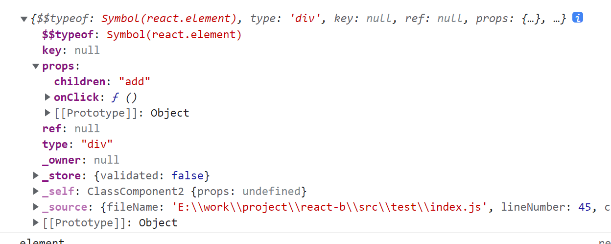

# 2022-2-14

## 1.首页白屏

SSR，服务端渲染，在服务端将渲染逻辑处理好，然后将最终html返回给前端。缺点是增加了服务器的开销，提升了前端人员的开发难度。

预渲染，在编译阶段将部分节点插入到index.html中，在初始渲染中就可以提前渲染出部分内容，后续再进行替换更新。缺点是动态数据无法显示，以及一些交互操作由于js没有加载完成所以无效，增加代码构建时间。

骨架屏，提前将页面整体布局绘制出来，优化用户体验。（loading效果也可以），缺点是使用图片或者自己编写、第三方插件生成骨架屏。

减少代码体积，使用插件：uglifyjs-webpack-plugin，webpack-parallel-uglify-plugin，terser-webpacck-plugin压缩js代码，mini-css-plugin压缩css代码，去掉无用空格，console信息，tree-shaking去掉无用代码。

文件拆分：考虑问题：1.该怎么拆，拆多少个。拆分要考虑逻辑：比如首屏的逻辑单独拆出来，其他的页面后续再加载；拆多少个，要考虑到数量，会不会增加请求开销。

其它方法：
css、html嵌套层架不宜过多，嵌套越多，打包后体积越大，浏览器解析起来会慢，样式计算阶段性能开销较大。
图片懒加载，预加载，路由懒加载，第三方库懒加载，ui样式按需引入，分屏渲染，图片压缩，提取公共模块。

### 浏览器并发数限制

首先，是基于端口数量和线程切换开销的考虑，浏览器不可能无限量的并发请求，因此衍生出来了并发限制和HTTP/1.1的Keep alive。 所以，IE6/7在HTTP/1.1下的并发才2，但HTTP/1.0却是4。 而随着技术的发展，负载均衡和各类NoSQL的大量应用，基本已经足以应对C10K的问题。 但却并不是每个网站都懂得利用domain hash也就是多域名来加速访问。因此，新的浏览器加大了并发数的限制，但却仍控制在8以内。

 已经说得很全面了，补充一小点就是浏览器即使放弃保护自己，将所有请求一起发给服务器，也很可能会引发服务器的并发阈值控制而被BAN，而另外一个控制在8以内的原因也是keep alive技术的存在使得浏览器复用现有连接和服务器通信比创建新连接的性能要更好一些。

所以，浏览器的并发数其实并不仅仅只是良知的要求，而是双方都需要保护自己的默契，并在可靠的情况下提供更好的性能。

前端技术的逐渐成熟，还衍生了domain hash, cookie free, css sprites, js/css combine, max expires time, loading images on demand等等技术。这些技术的出现和大量使用都和并发资源数有关。

1. 按照普通设计，当网站cookie信息有1 KB、网站首页共150个资源时，用户在请求过程中需要发送150 KB的cookie信息，在512 Kbps的常见上行带宽下，需要长达3秒左右才能全部发送完毕。 尽管这个过程可以和页面下载不同资源的时间并发，但毕竟对速度造成了影响。 而且这些信息在js/css/images/flash等静态资源上，几乎是没有任何必要的。 解决方案是启用和主站不同的域名来放置静态资源，也就是cookie free。
2. 将css放置在页面最上方应该是很自然的习惯，但第一个css内引入的图片下载是有可能堵塞后续的其他js的下载的。而在目前普遍过百的整页请求数的前提下，浏览器提供的仅仅数个并发，对于进行了良好优化甚至是前面有CDN的系统而言，是极大的性能瓶颈。 这也就衍生了domain hash技术来使用多个域名加大并发量（因为浏览器是基于domain的并发控制，而不是page），不过过多的散布会导致DNS解析上付出额外的代价，所以一般也是控制在2-4之间。 这里常见的一个性能小坑是没有机制去确保URL的哈希一致性（即同一个静态资源应该被哈希到同一个域名下），而导致资源被多次下载。 
3. 再怎么提速，页面上过百的总资源数也仍然是很可观的，如果能将其中一些很多页面都用到的元素如常用元素如按钮、导航、Tab等的背景图，指示图标等等合并为一张大图，并利用css background的定位来使多个样式引用同一张图片，那也就可以大大的减少总请求数了，这就是css sprites的由来。
4. 全站的js/css原本并不多，其合并技术的产生却是有着和图片不同的考虑。 由于cs/js通常可能对dom布局甚至是内容造成影响，在浏览器解析上，不连贯的载入是会造成多次重新渲染的。因此，在网站变大需要保持模块化来提高可维护性的前提下，js/css combine也就自然衍生了，同时也是minify、compress等对内容进行多余空格、空行、注释的整理和压缩的技术出现的原因。
5. 随着cookie free和domain hash的引入，网站整体的打开速度将会大大的上一个台阶。 这时我们通常看到的问题是大量的请求由于全站公有header/footer/nav等关系，其对应文件早已在本地缓存里存在了，但为了确保这个内容没有发生修改，浏览器还是需要请求一次服务器，拿到一个304 Not Modified才能放心。 一些比较大型的网站在建立了比较规范的发布制度后，会将大部分静态资源的有效期设置为最长，也就是Cache-Control max-age为10年。 这样设置后，浏览器就再也不会在有缓存的前提下去确认文件是否有修改了。  超长的[有效期](https://www.zhihu.com/search?q=有效期&search_source=Entity&hybrid_search_source=Entity&hybrid_search_extra={"sourceType"%3A"answer"%2C"sourceId"%3A15696641})可以让用户在访问曾访问过的网站或网页时，获得最佳的体验。 带来的复杂性则体现在每次对静态资源进行更新时，必须发布为不同的URL来确保用户重新加载变动的资源。
6. 即使是这样做完，仍然还存在着一个很大的优化空间，那就是很多页面浏览量很大，但其实用户直接很大比例直接就跳走了，第一屏以下的内容用户根本就不感兴趣。 对于超大流量的网站如淘宝、新浪等，这个问题尤其重要。   这个时候一般是通过将图片的src标签设置为一个loading或空白的样式，在用户翻页将图片放入可见区或即将放入可见区时再去载入。 不过这个优化其实和并发资源数的关系就比较小了，只是对一些散布不合理，或第一页底部的资源会有一定的帮助。 主要意图还是降低带宽费用。

总的来说，各类技术都是为了能让用户更快的看到页面进行下一步操作，但却不必将宝贵的资源浪费在没有必要的重复请求、不看的内容上。

## 2.wx小程序常用api

login, getuserInfo, authorize, getSetting, checkSession

## 3.vue-router实现原理

两大类：hash，history，区别是hash有#
vue-router根据mode参数来选择路由。
支持三种：history-HTML5History，hash-HashHistory，abstract-AbstractHistory
hash:
push:
$router.push() 调用方法-> HashHistory.push()设置hash，window.location.hash -> History.transitionTo() 检测更新-> History.updateRoute() 更新路由-> app._route替换当前app路由 -> vm.render()更新视图
replace: 
window.location.replace()

history:
通过history.pushState(), history.replaceState()，

### hash

hash变化会触发网页跳转，即浏览器的前进和后退。

`hash` 可以改变 `url` ，但是不会触发页面重新加载（hash的改变是记录在 `window.history` 中），即不会刷新页面。也就是说，所有页面的跳转都是在客户端进行操作。因此，这并不算是一次 `http` 请求，所以这种模式不利于 `SEO` 优化。`hash` 只能修改 `#` 后面的部分，所以只能跳转到与当前 `url` 同文档的 `url` 。

`hash` 通过 `window.onhashchange` 的方式，来监听 `hash` 的改变，借此实现无刷新跳转的功能。

`hash` 永远不会提交到 `server` 端（可以理解为只在前端自生自灭）。

### history

如果是用户在当前用histroy模式操作切换页面的话，URL会被改变、浏览器不会刷新页面也不会往服务端发请求，但会触发代码内的监听事件从而改变页面内容，所以无需用到服务器也可以自由切换页面了。但是这里有个很核心的点就是URL会改变，即有新的URL诞生，所以如果这时用户主动刷新页面（F5），浏览器发送给服务端的是新的URL，所以服务端要做适配，配置一个合理的规则让这些URL返回的都是同一个index.html

## 4.gzip

大流量的WEB站点常常使用GZIP压缩技术来让用户感受更快的速度。这一般是指WWW服务器中安装的一个功能，当有人来访问这个服务器中的网站时，
服务器中的这个功能就将网页内容压缩后传输到来访的电脑浏览器中显示出来.一般对纯文本内容可压缩到原大小的40%.这样传输就快了，效果就是你点击
网址后会很快的显示出来.当然这也会增加服务器的负载. 一般服务器中都安装有这个功能模块的。

## 5.node几大模块

node天生自带的模块（核心模块），fs, path, url(解析req.url), mime(获取文件类型), express(创建服务)；
node的第三方模块；通过npm包管理器下载的模块；
自定义模块（即自己写的js文件；在node环境中运行的js文件，一个文件就是一个模块）。,

## 6.node事件循环队列

同步和异步任务分别进入不同的执行环境，同步的进入主线程，即主执行栈，异步的进入任务队列。主线程内的任务执行完毕为空，会去任务队列读取对应的任务，推入主线程执行。 
上述过程的不断重复就是我们说的 Event Loop (事件循环)。

Node.js 采用事件驱动和异步 I/O 的方式，实现了一个单线程、高并发的 JavaScript 运行时环境。
Node.js 针对这一事实采用了单线程模型来处理，它不会为每个接入请求分配一个线程，而是用一个主线程处理所有的请求，然后对 I/O 操作进行异步处理，
避开了创建、销毁线程以及在线程间切换所需的开销和复杂性。
Node.js 在主线程里维护了一个事件队列，当接到请求后，就将该请求作为一个事件放入这个队列中，然后继续接收其他请求。当主线程空闲时(没有请求接入时)，
就开始循环事件队列，检查队列中是否有要处理的事件，这时要分两种情况：如果是非 I/O 任务，就亲自处理，并通过回调函数返回到上层调用；如果是 I/O 任务，
就从 线程池 中拿出一个线程来处理这个事件，并指定回调函数，然后继续循环队列中的其他事件。

# 2022--2-17

## 1.你的薪资，税前税后

实话实说

## 2.你对加班的看法

不喜欢形式主义加班，完成自己的工作任务或者是团队项目工作量较大时可以接受加班，但是不能够接受为了加班而加班，降低工作
效率，并且影响身体健康。

## 3.你为什么离职

一、公司加班严重，多次熬夜或通宵，双休不能得到较好大的保证；
二、项目开发过程中，产品需求变动太频繁，没有很好的规范的开发流程，多次提出建议也没有得到改善；
三、没有时间提升自己的技术水平

## 4.你有什么爱好

网球，平时喜欢运动

## 5.你喜欢看书吗

看一些散文或者技术类的文章，平时也喜欢直接看一些学习类的视频

## 6.毕业不到一年，你为什么觉得你可以拿到期望的薪资

对比了贵公司的招聘要求和工资范围，我觉得我值得这个工资。

# 一面：技术面

## 1.nextTick

https://www.jianshu.com/p/a7550c0e164f

## 2.sync语法糖实现原理

https://www.jianshu.com/p/b149f9fd8178?utm_campaign=maleskine&utm_content=note&utm_medium=seo_notes&utm_source=recommendation

## 3.前端dist构建

## 4.继承

## 5.怎么实现一个view-model

## 6.vue组件间通信

https://blog.csdn.net/Albert_weiku/article/details/123855707

## 7.geneater

## 8.async 和await底层原理

https://www.jianshu.com/p/0f1b6ae1888c

## 9.事件队列

https://blog.csdn.net/weixin_39991222/article/details/113367173

# 积累

## 1.react阻止事件冒泡方法

https://zhuanlan.zhihu.com/p/26742034

## 2.commonjs和es6module区别

https://www.zhihu.com/question/62791509/answer/1535800470

## 3.webpack构建原理

https://www.cnblogs.com/chengxs/p/11022842.html

### webpack与vite打包区别

webpack会先打包，然后启动开发服务器，请求服务器时直接给予打包结果。 而vite是直接启动开发服务器，请求哪个模块再对该模块进行实时编译。 由于现代浏览器本身就支持ES Module，会自动向依赖的Module发出请求。vite充分利用这一点，将开发环境下的模块文件，就作为浏览器要执行的文件，而不是像webpack那样进行打包合并。 由于vite在启动的时候不需要打包，也就意味着不需要分析模块的依赖、不需要编译，因此启动速度非常快。当浏览器请求某个模块时，再根据需要对模块内容进行编译。这种按需动态编译的方式，极大的缩减了编译时间，项目越复杂、模块越多，vite的优势越明显。 在HMR方面，当改动了一个模块后，仅需让浏览器重新请求该模块即可，不像webpack那样需要把该模块的相关依赖模块全部编译一次，效率更高。 当需要打包到生产环境时，vite使用传统的rollup进行打包，因此，vite的主要优势在开发阶段。另外，由于vite利用的是ES Module，因此在代码中不可以使用CommonJS

详细解答：https://juejin.cn/post/7031421642513317918#heading-0

vite使用esbuild预编译目的：https://cn.vitejs.dev/guide/dep-pre-bundling.html

## 4.tree-shaking原理

是一种通过清除多余代码方式来优化项目打包体积的技术，es6module引入进行静态分析，所以编译时可以正确判断到底加载了哪些模块，判断哪些模块和变量未被使用或者引用，进而对代码进行删除。

**摇树删除代码的原理：** webpack基于ES6提供的模块系统，对代码的依赖树进行静态分析，把import & export标记为3类：

- 所有import标记为/* harmony import */
- 被使用过的export标记为/harmony export([type])/，其中[type]和webpack内部有关，可能是binding，immutable等；
- 没有被使用的export标记为/* unused harmony export [FuncName] */，其中[FuncName]为export的方法名，之后使用Uglifyjs（或者其他类似的工具）进行代码精简，把没用的都删除。

**条件：**

1. 首先源码必须遵循 ES6 的模块规范 (import & export)，如果是 CommonJS 规范 (require) 则无法使用。
2. 编写的模块代码不能有副作用，如果在代码内部改变了外部的变量则不会被移除。在package.json中声明**sideEffects: false**（sideEffects如果设为false，webpack就会认为所有没用到的函数都是没副作用的，即删了也没关系）


## 5.webpack打包优化commonChunkPlugin

https://zhuanlan.zhihu.com/p/261318126.

## 6.微信小程序的双线程模型

网页开发，渲染线程和脚本是互斥的，**意思是，当 JavaScript 代码被执行时，GUI 渲染线程会被挂起，等待 JavaScript 引擎线程空闲时再被执行，以免在渲染期间被 JavaScript 重复地修改 DOM 造成不必要的渲染压力。采用互斥的模式等待 JavaScript 代码执行完毕后，可以保证渲染是最终的执行结果。所以浏览器的空闲（Idle）时长也成了衡量网站性能的重要指标之一，空闲时长多代表 JavaScript 逻辑不密集以及 DOM改动频率低，这种情况下浏览器可以更快速顺畅地响应用户的交互行为**，这也是为什么长时间的脚本运行可能会导致页面失去响应的原因，本质就是我们常说的 `JS` 是单线程的

而在小程序中，选择了 `Hybrid` 的渲染方式，将视图层和逻辑层是分开的，双线程同时运行，视图层的界面使用 `WebView` 进行渲染，逻辑层运行在 `JSCore` 中。

小程序得js脚本里是不能直接操作dom的，而是通过setData，来更新数据去异步渲染视图，所以，可以直接把渲染线程和js逻辑线程分离开来，这样渲染线程就可以快速渲染，而不会被js执行给阻塞。

https://www.cnblogs.com/ihardcoder/p/14778013.html

## 7.cdn是什么

https://www.zhihu.com/question/36514327?rf=37353035

由分布在不同区域的边缘节点服务器群组成的分布式网络。

（1）CDN的加速资源是跟域名绑定的。
（2）通过域名访问资源，首先是通过DNS分查找离用户最近的CDN节点（边缘服务器）的IP
（3）通过IP访问实际资源时，如果CDN上并没有缓存资源，则会到源站请求资源，并缓存到CDN节点上，这样，用户下一次访问时，该CDN节点就会有对应资源的缓存了。

## 8.如何理解虚拟dom和diff算法

通过新旧虚拟dom对比获得最小dom操作量，配合异步更新策略减少刷新频率，提高性能

## 9.this隐式丢失四种情况

1.函数名是别名

```javascript
function foo(){
  console.log(this.a);
}
var obj={
a:2,
foo:foo
}
var bar=obj.foo;
var a=1;
bar()  //  输出1  this指向了window
```

2.函数作为参数传递（回调函数）

```javascript
function foo(){
   console.log(this.a);
}
function Foo(fn){
   fn();
}
var obj={
   a:2,
   foo:foo
}
var a=1;
Foo(obj.foo)//输出1
```

3.出现在内置函数中

```javascript
function foo(){
   console.log(this.a);
}

var obj={
   a:2,
   foo:foo
}
var a=1;
setTimeout(obj.foo,200)//输出1
```

4.函数赋值，我觉得类似于函数别名，此时直接在指向函数的指针处调用函数，缺失了前面的对象

```javascript
function foo(){
   console.log(this.a);
}

var obj={
   a:2,
   foo:foo
}
var obj2={
    a:3,
}
var a=1;

(obj2.foo=obj.foo)();//输出1
```

## 10.使用react hook中遇到的最难的问题

https://react.docschina.org/docs/hooks-faq.html#is-it-safe-to-omit-functions-from-the-list-of-dependencies

## 11.tree-shaking原理

https://blog.csdn.net/frontend_frank/article/details/113821210

## 12. seo优化

https://juejin.cn/post/6980167371864424456#heading-4
title, keyword, description, background-image, img-alt, a-ref=nofollow，语义化，提高加载速度

## 13.flex

https://juejin.cn/post/7063823914136256543
flex: flex-grow flex-shrink flex-basis

默认值是：0 1 auto

1: 1 1 0%
auto: 1 1 auto
none: 0 0 auto

## 14.gpu硬件加速

https://juejin.cn/post/6844903649974435854

## 15.javascript中数组是如何存储的

数组中可以存放不同的数据结构，可以存放数组、对象、Number、Undefined、Null、String、Symbol、Boolean、Function等等。
数组的index是字符串类型的，之所以你可以通过arr[1]，获得对应的数据，是因为Javascript自动将数字转化为字符串。
数组本来应该是一个连续的内存分配，但是在Javascript中不是连续分配的，而是类似哈希映射的方式存在的。
对于上述的实现方式，熟悉数据结构的同学应该知道，对于读取操作，哈希表的效率并不高，而修改删除的效率比较高。
现在浏览器为了优化其操作，对数组的创建时候的内存分配进行了优化：

对于同构的数组，也就是，数组中元素类型一致，会创建连续的内存分配
对于不同构数组，按照原来的方式创建。
如果你想插入一个异构数据，那么就会重新解构，通过哈希映射的方式创建
为了进一步优化功能的实现，Javascript中出现了ArrayBuffer，它可以创建连续的内存供编程人员使用。

ArrayBuffer是创建一块连续的内存，不能直接操作
通过视图对分配的内存进行读写操作
显而易见，如果通过ArrayBuffer创建的数组进行遍历操作，速度更快。

## 16.setState什么时候会进行同步操作

https://blog.csdn.net/qq_43182723/article/details/106802413
https://stackoverflow.com/questions/48563650/does-react-keep-the-order-for-state-updates/48610973#48610973
https://github.com/facebook/react/issues/11527

## 17.get和post

https://juejin.cn/post/7078956663440408612#heading-4

## 18.什么是灰度发布，蓝绿发布，滚动发布

https://juejin.cn/post/6951186920953249806

## 19.懒加载

https://juejin.cn/post/6844904007589183501

## 20 npm run xxx发生了什么

https://juejin.cn/post/7078924628525056007

## 21.事件是如何实现的

基于发布订阅模式，就是在浏览器加载的时候会读取事件相关的代码，但是只有实际等到具体的事件触发的时候才会执行。

比如点击按钮，这是个事件（Event），而负责处理事件的代码段通常被称为事件处理程序（Event Handler），也就是「启动对话框的显示」这个动作。

在 Web 端，我们常见的就是 DOM 事件：

- DOM0 级事件，直接在 html 元素上绑定 on-event，比如 onclick，取消的话，dom.onclick = null，同一个事件只能有一个处理程序，后面的会覆盖前面的。

- DOM2 级事件，通过 addEventListener 注册事件，通过 removeEventListener 来删除事件，一个事件可以有多个事件处理程序，按顺序执行，捕获事件和冒泡事件

- DOM3级事件，增加了事件类型，比如 UI 事件，焦点事件，鼠标事件

- [zhuanlan.zhihu.com/p/73091706](https://link.juejin.cn/?target=https%3A%2F%2Fzhuanlan.zhihu.com%2Fp%2F73091706)

## 22.事件冒泡和捕获

三个阶段：捕获阶段，处于目标阶段，冒泡阶段

先捕获再冒泡：父捕获 > 子捕获 > 子冒泡 > 父冒泡

addEventListener第二个参数为true为事件捕获，默认为false

注意这里一定是捕获再冒泡，和js中代码书写顺序无关

## 23.如何使用es5实现const，let

```javascript
function _const(key, value) {
  Object.defineProperty(window, key, {
    enumerable: false,
    configurable: false,
    get() {
      return value
    },
    set(newValue) {
      throw new Error('Assagement to constant variable')
    }
  })
}

function _let(key, value) {
  Object.defineProperty(window, key, {
    enumerable: false,
    configurable: true,
    writable: true,
    value: value
  })
}

// console.log('before', myName, age)

_const('myName', 'dj')
_let('age', 18)

console.log('next', myName, age)
age = 23


console.log('final', myName, age)
myName = 'patrick'
```

## 24.实现一个链式调用，同时实现sleep方法

https://juejin.cn/post/7045918126931705886

```javascript
class Chain {
  constructor() {
    this.fns = []

    setTimeout(() => {
      this.next()
    })
  }
  hello() {
    const fn = () => {
      console.log('hello')
      this.next()
    }
    this.fns.push(fn)
    return this
  }

  sleep(time=0) {
    const fn = () => {
      setTimeout(() => {
        this.next()
      }, time)
    }
    this.fns.push(fn)
    return this
  }

  next() {
    const fn = this.fns.shift()
    fn && fn()
  }
}

const c = new Chain()

c.hello().hello().sleep(2000).hello()
```

promise版本

```javascript
class U {
  constructor() {
    this.promise = Promise.resolve();
  }

  console(val) {
    this.promise = this.promise.then(() => {
      console.log(val);
    });
    return this;
  }

  setTimeout(wait) {
    this.promise = this.promise.then(() => {
      return new Promise((resolve) => {
        setTimeout(() => {
          resolve();
        }, wait);
      });
    });
    return this;
  }
}
const u = new U();
u.console("breakfast")
  .setTimeout(3000)
  .console("lunch")
  .setTimeout(3000)
  .console("dinner");
```

## 25.实现一个能执行next的中间件函数

```javascript
/**
 * 实现一个组合compose的方法，使其可以正确调用每个中间件
 *
 * 规定中间件写法：
 * function(val, next) {
 *    // 前置操作
 *    next(val + 1); // 触发下一个中间件
 *    // 后续操作
 * }
 */
function compose(...middlewares) {
  let currentIdx = 0

  const fns = middlewares.map((fn, idx) => {
    return (x, next) => {
      currentIdx = idx
      fn(x, next)
    }
  })

  function next(x) {
    fns[currentIdx + 1](x, next)
  }

  return (input) => {
    fns[0] && fns[0](input, next)
  }
}

function add1(x, next) {
  console.log('add1 before');
  next(x + 1);
  console.log('add1 after');
}

function add2(x, next) {
  console.log('add2 before');
  next(x + 2);
  console.log('add2 after');
}

function output(x){
    console.log('output:', x)
}

const input = 0;
compose(add1, add2, (output) => {
  console.log('output:', output);
})(input);

/**
 * 输出:
 *
 * add1 before
 * add2 before
 * output: 3
 * add2 after
 * add1 after
 */
```

## 26.vue的插件机制，底层实现原理是什么

## 27.vue的computed设计动机以及底层实现

## 28.vuex中变量打包后存在哪里？刷新后消失怎么实现储存

因为js代码运行在[内存](https://so.csdn.net/so/search?q=内存&spm=1001.2101.3001.7020)中，代码运行时所有的变量和函数都是保存在 **内存** 中的，通过保存在sessionStorage里或者localStorage里。

3种处理方式：

1. 是在mutation里保存在storage中

   ```javascript
   import Vue from 'vue'
   import Vuex from 'vuex'
   Vue.use(Vuex)
   export default new Vuex.Store({
     state: {
       //  直接使用本地存储的方式
       name: JSON.parse(sessionStorage.getItem('name')) || 'name'
     },
     mutations: {
       set(state, data) {
         //  修改数据的时候直接存到本地
         sessionStorage.setItem('name', JSON.stringify(data))
         state.name = data
       }
     },
   })
   
   ```

2. 第二种是通过建通beforeunload事件，再页面销毁的时候再手动添加进storage里，监听DOMContentLoaded，在页面内容加载的时候再从storage里读出来。

   ```javascript
   export default function (ctx) {
       //离开页面 刷新前 将store中的数据存到session
       window.addEventListener('beforeunload', () => {
           sessionStorage.setItem("storeCache", JSON.stringify(ctx.store.state))
       });
       //页面加载完成  将session中的store数据
       document.addEventListener('DOMContentLoaded', () => {
           let storeCache = sessionStorage.getItem("storeCache")
           if (storeCache) {
               // 将session中的store数据替换到store中
               ctx.store.replaceState(JSON.parse(storeCache));
           }
       });
   }
   
   ```

3. 通过使用插件的方式**vuex-persistedstate**，原理其实也是放在storage里，只是通过配置自动实现。


## 29.vue中css scroped实现原理

https://juejin.cn/post/6844903965746790408

## 30.输入框防抖

https://juejin.cn/post/7040823172094132237

## 31.ES5/ES6 的继承除了写法以外还有什么区别？

https://github.com/Advanced-Frontend/Daily-Interview-Question/issues/20

## 32.JS 异步解决方案的发展历程以及优缺点。

callback-回调地狱

promise-链式调用，then

generater-next

async/await-promise语法糖，类似generater

## 33.介绍下 npm 模块安装机制，为什么输入 npm install 就可以自动安装对应的模块？

### 当我们执行时会发生什么`npm install`？

我们都知道该命令`npm install`会从 npm-registry 下载依赖模块。
这可以通过以下任何一种方式。

1. `npm install`- 获取依赖关系树中提到的所有依赖关系。
2. `npm install <dependency_name>`或`npm install <dependency_name>@<version>`- 按名称和版本获取特定依赖项（如果未指定版本，则提取最新版本）。
3. `npm install <git remote url>`- 获取推送到 github 或 bitbucket 或 gitlab 的库。

### 模块安装过程

先跳过依赖梳理的过程

1. 查找此模块是否已经在node_modules中安装过，然后再.npm 缓存中查看是否有同版本缓存
2. 如果有缓存，直接使用缓存
3. 没有缓存去registry中按照registry/packagename/version模式搜索模块
4. 将模块下载并解压到node_modules目录中，如果模块是可执行模块，将可执行文件放到 .bin 目录中
5. 同时在模块放在 .npm 中作为副本缓存

### 依赖关系梳理

1. 由于顶层模块下面可能依赖其他模块，模块之间存在嵌套依赖，packge.lock.json记录了模块的逻辑依赖树
2. 如果完全安装逻辑依赖关系安装，会存在大量重复的包，npm会对安装做dudupe抹平处理，将重复的包安装在顶层
3. 当模块安装时，先安装顶层模块，然后安装顶层模块的依赖模块，npm会检查顶层是否存在此模块，如果不存在将此模块安装在顶层
4. 如果顶层已存在相同模块，检查版本是否符合要求（版本号不同，则需要再当前模块下的node_modules下重新安装）-
   - 符合要求，不再安装模块，直接跳过
   - 不符合要求，在当前模块目录node_modeules下安装模块
5. 重复此过程，直到顶层模块的嵌套依赖安装完毕

https://github.com/Advanced-Frontend/Daily-Interview-Question/issues/22

https://dev.to/shree_j/how-npm-works-internally-4012

https://juejin.cn/post/6969450118839795749#heading-7

### npm yarn 区别

https://juejin.cn/post/7103804890547224583

## 34.为什么 Vuex 的 mutation 和 Redux 的 reducer 中不能做异步操作

https://github.com/Advanced-Frontend/Daily-Interview-Question/issues/65

一种规范，确保是纯函数才能保证state的状态可预测，因为异步操作是成功还是失败不可预测，什么时候进行异步操作也不可预测；当异步操作成功或失败时，如果不 commit(mutation) 或者 dispatch(action)，Vuex 和 Redux 就不能捕获到异步的结果从而进行相应的操作。

## 35.双向绑定和 vuex 是否冲突

https://vuex.vuejs.org/zh/guide/forms.html#%E5%8F%8C%E5%90%91%E7%BB%91%E5%AE%9A%E7%9A%84%E8%AE%A1%E7%AE%97%E5%B1%9E%E6%80%A7

## 36.为什么通常在发送数据埋点请求的时候使用的是 1x1 像素的透明 gif 图片？

1. 能够完成整个 HTTP 请求+响应（尽管不需要响应内容）
2. 触发 GET 请求之后不需要获取和处理数据、服务器也不需要发送数据
3. 跨域友好
4. 执行过程无阻塞
5. 相比 XMLHttpRequest 对象发送 GET 请求，性能上更好
6. GIF的最低合法体积最小（最小的BMP文件需要74个字节，PNG需要67个字节，而合法的GIF，只需要43个字节）

https://mp.weixin.qq.com/s/v6R2w26qZkEilXY0mPUBCw?utm_source=tuicool&utm_medium=referral

https://github.com/Advanced-Frontend/Daily-Interview-Question/issues/87

## 37.实现一个promise.finally

https://github.com/Advanced-Frontend/Daily-Interview-Question/issues/109

## 38.介绍下 webpack 热更新原理，是如何做到在不刷新浏览器的前提下更新页面

https://github.com/Advanced-Frontend/Daily-Interview-Question/issues/118

## 39.介绍下前端加密的常见场景和方法

https://github.com/Advanced-Frontend/Daily-Interview-Question/issues/150

## 40.跨域解决方案以及为什么会有跨域

### 同源策略

1995年，同源政策由 Netscape 公司引入浏览器。目前，所有浏览器都实行这个政策。

最初，它的含义是指，A 网页设置的 Cookie，B 网页不能打开，除非这两个网页“同源”。所谓“同源”指的是“三个相同”：

- 协议相同
- 域名相同
- 端口相同

同源政策的目的，是为了保证用户信息的安全，防止恶意的网站窃取数据。

设想这样一种情况：A 网站是一家银行，用户登录以后，A 网站在用户的机器上设置了一个 Cookie，包含了一些隐私信息（比如存款总额）。用户离开 A 网站以后，又去访问 B 网站，如果没有同源限制，B 网站可以读取 A 网站的 Cookie，那么隐私信息就会泄漏。更可怕的是，Cookie 往往用来保存用户的登录状态，如果用户没有退出登录，其他网站就可以冒充用户，为所欲为。因为浏览器同时还规定，提交表单不受同源政策的限制。

由此可见，同源政策是必需的，否则 Cookie 可以共享，互联网就毫无安全可言了。

随着互联网的发展，同源政策越来越严格。目前，如果非同源，共有三种行为受到限制。

1. 无法获取非同源网页的 cookie、localstorage 和 indexedDB。
2. 无法访问非同源网页的 DOM （iframe）。
3. 无法向非同源地址发送 AJAX 请求 或 fetch 请求（可以发送，但浏览器拒绝接受响应）。

### 为什么要有跨域

Ajax 的同源策略主要是为了防止 `CSRF`（跨站请求伪造） 攻击，如果没有 AJAX 同源策略，相当危险，我们发起的每一次 HTTP 请求都会带上请求地址对应的 cookie，那么可以做如下攻击：

1. 用户登录了自己的银行页面 [mybank.com](https://link.juejin.cn?target=http%3A%2F%2Fmybank.com)，[mybank.com向用户的cookie中添加用户标识](https://link.juejin.cn?target=http%3A%2F%2Fmybank.xn--comcookie-yl6nr50bkgel81dia434tvyv911aka617dcq3j)。
2. 用户浏览了恶意页面 [evil.com](https://link.juejin.cn?target=http%3A%2F%2Fevil.com)。执行了页面中的恶意AJAX请求代码。
3. [evil.com向http](https://link.juejin.cn?target=http%3A%2F%2Fevil.xn--comhttp-6y3l)://mybank.com发起AJAX HTTP请求，请求会默认把http://mybank.com对应cookie也同时发送过去。
4. 银行页面从发送的cookie中提取用户标识，验证用户无误，response中返回请求数据。此时数据就泄露了。
5. 而且由于Ajax在后台执行，用户无法感知这一过程。

DOM同源策略也一样，如果 `iframe` 之间可以跨域访问，可以这样攻击：

1. 做一个假网站，里面用iframe嵌套一个银行网站 [mybank.com](https://link.juejin.cn?target=http%3A%2F%2Fmybank.com)。
2. 把iframe宽高啥的调整到页面全部，这样用户进来除了域名，别的部分和银行的网站没有任何差别。
3. 这时如果用户输入账号密码，我们的主网站可以跨域访问到http://mybank.com的dom节点，就可以拿到用户的输入了，那么就完成了一次攻击。

所以说有了跨域跨域限制之后，我们才能更安全的上网了。

参考文章：https://juejin.cn/post/6844903816060469262#heading-0

## 41.vue源码问题

### new Vue到底发生了什么？

定位到Vue的构造函数里：干了一件事，调用init方法，参数是options
而init主要干了的事：

1. 合并选项，向optons里添加一些额外属性
2. initProxy，定义了需要使用哪一种proxy handler，定义到vm\.renderProxy上，我也不知道这个是干什么的，但是从里面的提示警告信息来看，应该是约束一些设置的data和method的命名规范，比如data中属性不能以$和\_开头，这段代码的目的主要就是为Vue实例的_renderProxy属性赋值，而这个`_renderProxy`目测就是用在`render`函数中的。我们在`vue/src/core/instance/render.js`中

   ```javascript
   const { render, _parentVnode } = vm.$options
   ……
   currentRenderingInstance = vm
   vnode = render.call(vm._renderProxy, vm.$createElement)
   ```

   因此，这个`vm._renderProxy`实际上指定了我们传入的这个`render`函数在创建Vnode的时候执行的上下文this。
   回到上面，那么这个`initProxy`函数又是怎么给_renderProxy属性赋值的呢？

   ```javascript
   initProxy = function initProxy (vm) {
       if (hasProxy) {
           // determine which proxy handler to use
           const options = vm.$options
           const handlers = options.render && options.render._withStripped ? getHandler : hasHandler
           vm._renderProxy = new Proxy(vm, handlers)
   
       } else {
           vm._renderProxy = vm
       }
   }
   ```

   所以我们的`_renderProxy`属性赋值情况可以总结如下：

   1. 当前环境是开发环境，并且`hasProxy`条件成立，则调用Proxy方法，给vue实例添加代理
   2. 如果其他情况，则vue实例的_renderProxy属性指向vue实例本身。

3. vm\.\_self=vm 将自己设置到_self属性上
4. initLifecycle(vm)，初始化当前vm的部分一些生命周期重要属性和vm的parent和root，比如$parent(当前节点的第一个非抽象的父亲节点），$children，$refs, \_isMounted, \_isDestroyed, \_isBeginDestroyed_
5. initEvents(vm)，初始化\_events, hasHookEvent，获取父亲节点的listeners，如果有，则需要更新到当前节点里。更新方式就是调用$on和$off进行事件的监听和解绑。
6. initRender(vm)，向vm上添加render相关属性，比如_vnode，$slot，$scopeSlots，$createElement，将parent的attrs和listeners设置到vm上去（通过defoneReactive）
7. callHook(vm, 'beforeCreate') 此时完成了实例的初始化，但是还没有进行数据的侦听
8. initInjections(vm)，根据options中的inject选项，向上递归查找祖先的provide，拿到值（已经有key），然后再defineReactive到vm上
9. initState(vm)，按顺序初始化：props，methods，data，computed，watch
   - initProps: 关键在于两个：key和value，先通过key去找value，如果有就返回然后做一堆处理，其实就是挂载到某个变量下面，比如_props，没有就用props中的default值，返回之前需要做一个observe()，用于将这个值变成响应式。
   - initMethods: 做的内容很简单，`vm[key] = typeof methods[key] !== 'function' ? noop : bind(methods[key], vm)`，就是把method挂载vm中，同时把方法进行bind一下vm，确保method中的this是当前的实例。
   - initData: 主要做一件事——`observe(data, true /* asRootData */)`响应式绑定。利用Object.defineProperty从写对象的set和get方法
   - initComputed: 下面有
   - initWatch：下面有

10. initProvide(vm)，初始化vm_provided

11. callHook(vm, 'created') 完成了数据的侦听，但是还没有进行挂载

我的感觉，再init里，其实做了两件事：

1. 初始化一些vue中需要使用的基础属性，不在options里体现
2. 将options里的属性进行处理，然后挂载到vm上

### computed和watch

#### computed:

非服务端渲染下：

Object.defineProperty(vm, key, handler)

key是computed的key，重点获取值是在handler的get上，每个key都会有一个watcher，然后在handler的get方法中去使用watcher

```javascript
return function computedGetter () {
    const watcher = this._computedWatchers && this._computedWatchers[key]
    if (watcher) {
         // computed 计算属性实现缓存的原理，标记当前回调函数在本次渲染周期内是否已经被执行过
      if (watcher.dirty) {
        watcher.evaluate()
      }
      if (Dep.target) {
        watcher.depend()
      }
      return watcher.value
    }
  }
```

在每次watcher.update时，会重新把dirty的值设置为true，然后重新调用一个get方法获取最新的值，否者就使用的是watcher中的老值。

### 实例销毁阶段

```javascript
Vue.prototype.$destroy = function () {
  const vm: Component = this
  if (vm._isBeingDestroyed) {
    return
  }
  callHook(vm, 'beforeDestroy')
  vm._isBeingDestroyed = true
  // remove self from parent
  const parent = vm.$parent
  if (parent && !parent._isBeingDestroyed && !vm.$options.abstract) {
    remove(parent.$children, vm)
  }
  // teardown watchers
  if (vm._watcher) {
    vm._watcher.teardown()
  }
  let i = vm._watchers.length
  while (i--) {
    vm._watchers[i].teardown()
  }
  // remove reference from data ob
  // frozen object may not have observer.
  if (vm._data.__ob__) {
    vm._data.__ob__.vmCount--
  }
  // call the last hook...
  vm._isDestroyed = true
  // invoke destroy hooks on current rendered tree
  vm.__patch__(vm._vnode, null)
  // fire destroyed hook
  callHook(vm, 'destroyed')
  // turn off all instance listeners.
  vm.$off()
  // remove __vue__ reference
  if (vm.$el) {
    vm.$el.__vue__ = null
  }
  // release circular reference (##6759）
  if (vm.$vnode) {
    vm.$vnode.parent = null
  }
}
```

总结一下干了什么事情：

1. 触发beforeDestroyed钩子函数
2. 将自己从父节点移除
3. 移除vm上监听的watchers
4. 将_isDestroyed设置为true
5. patch(oldNode, null)，更新虚拟dom
6. 触发destroyed钩子函数
7. 调用$off关闭listeners
8. 将$el等等一些属性设置为空

### watch

拿到key和handler，内部调用了vm.$watch方法，在这里面创建一个watcher，在new的constructor里会把key赋值给getter属性，handler赋值给cb属性，在赋值watcher.value时就会调用this.get方法，get方法又会调用this.getter，因为这里getter是一个key值，所以watcher会处理下，执行this.getter()其实就是在访问vm[key], 这样就会触发响应式数据对应key的getter，就会收集这个watcher，然后在key值触发setter方法时，就会通知这个watcher，然后执行watcher.update方法，接着就是异步调度了，反正最后一定会执行watcher.run方法的，在这个方法里就会调用之前设置的cb方法，把watcher的新旧值传入，完成了一个watch的过程

```javascript
run () {
    if (this.active) {
      const value = this.get()
      if (value !== this.value || isObject(value) || this.deep) {
        // set new value
        const oldValue = this.value
        this.value = value
        if (this.user) {
          const info = `callback for watcher "${this.expression}"`
          invokeWithErrorHandling(this.cb, this.vm, [value, oldValue], this.vm, info)
        } else {
           // 就是在这里执行cb
          this.cb.call(this.vm, value, oldValue)
        }
      }
    }
  }
```

过程：initWatch, createWatcher, vm.$watch在这个函数里创建watcher

### Vue.extend实现原理

```javascript
//  src/global-api/initExtend.js
import { mergeOptions } from "../util/index";
export default function initExtend(Vue) {
  let cid = 0; //组件的唯一标识
  // 创建子类继承Vue父类 便于属性扩展
  Vue.extend = function (extendOptions) {
    // 创建子类的构造函数 并且调用初始化方法
    const Sub = function VueComponent(options) {
      this._init(options); //调用Vue初始化方法
    };
    Sub.cid = cid++;
    Sub.prototype = Object.create(this.prototype); // 子类原型指向父类
    Sub.prototype.constructor = Sub; //constructor指向自己
    Sub.options = mergeOptions(this.options, extendOptions); //合并自己的options和父类的options
    return Sub;
  };
}
```

https://juejin.cn/post/6954173708344770591

## 42.vue的两个版本，以及编译过程

https://juejin.cn/post/6844904029877698568

https://juejin.cn/post/6907848991761760263

https://cn.vuejs.org/v2/guide/installation.html#%E5%AF%B9%E4%B8%8D%E5%90%8C%E6%9E%84%E5%BB%BA%E7%89%88%E6%9C%AC%E7%9A%84%E8%A7%A3%E9%87%8A

如果带有vue-loader，打包时就编译

还有一种是运行时编译，会在mount挂载时编译，第一次会有性能问题，后面会缓存起来，不会那么卡

这里的编译其实就是把template转换成渲染函数

template => render => vdom =>dom

这里的编译其实就三个流程：template => ast => render

compile具体点就是：先将通过parser解析template转换成一个ast，然后调用transform对ast进行一层加工得到一个新的ast，再通过generate方法把ast转换成渲染函数render，是一串字符串， 通过new Function的方式生成函数，就完成了。

在进行mount的时候，就会用到这个render，生成vdom，再通过patch方法，比较新老vdom进行生成真实dom

### 编译的具体流程

这里可以看到上面的三个流程，先通过parse把template转换成ast，再通过optimize对ast增加一些选项，最后通过generate将ast转化为render函数，对应下面代码中的code.render，这里注意，此时的code.render还是一个用字符串，里面是一个with函数

```js
export const createCompiler = createCompilerCreator(function baseCompile (
  template: string,
  options: CompilerOptions
): CompiledResult {
  const ast = parse(template.trim(), options)
  if (options.optimize !== false) {
    optimize(ast, options)
  }
  const code = generate(ast, options)
  return {
    ast,
    render: code.render,
    staticRenderFns: code.staticRenderFns
  }
})
```

```js
export function generate (
  ast: ASTElement | void,
  options: CompilerOptions
): CodegenResult {
  const state = new CodegenState(options)
  const code = ast ? genElement(ast, state) : '_c("div")'
  return {
    render: `with(this){return ${code}}`,
    staticRenderFns: state.staticRenderFns
  }
}
```

再来看看createCompilerCreator函数实现，其实这个函数就是为了生成一个生成compiler的生成器--createCompiler，利用函数柯里化，把baseCompile函数扔进compile函数里，这样在compile函数里调用者只用关注baseOptions即可，具体的生成code.render已经在baseCompile里实现了。

```js
function createCompilerCreator (baseCompile) {
  return function createCompiler (baseOptions) {
    function compile (
      template,
      options
    ) {
      var compiled = baseCompile(template, finalOptions);
      compiled.errors = errors;
      compiled.tips = tips;
      return compiled
    }

    return {
      compile: compile,
      compileToFunctions: createCompileToFunctionFn(compile)
    }
  }
}
```

此时我们调用`var ref = createCompiler(baseOptions);var compile = ref.compile;`就拿到了compile函数。

调用compile函数传入template和options，就可以得到compiled对象，我们主要取上面的render属性值，注意这里<font color=#ec7259>**compiled.render是个字符串**</font>，所以我们通过createFuntion把它变成一个真正的函数，createFunction内部实现就是`return new Function(code)`

```js
var compiled = compile(template, options);

// turn code into functions
var res = {};
var fnGenErrors = [];
res.render = createFunction(compiled.render, fnGenErrors);
res.staticRenderFns = compiled.staticRenderFns.map(function (code) {
   return createFunction(code, fnGenErrors)
});
```

## 42.vue路由守卫

全局路由守卫，路由独享守卫，组件级路由守卫

https://router.vuejs.org/zh/guide/advanced/navigation-guards.html

## 43.垃圾回收策略

在 JavaScript 内存管理中有一个概念叫做 `可达性`，就是那些以某种方式可访问或者说可用的值，它们被保证存储在内存中，反之不可访问则需回收

至于如何回收，其实就是怎样发现这些不可达的对象（垃圾）它并给予清理的问题， `JavaScript` 垃圾回收机制的原理说白了也就是定期找出那些不再用到的内存（变量），然后释放其内存

你可能还会好奇为什么不是实时的找出无用内存并释放呢？其实很简单，实时开销太大了

我们都可以 Get 到这之中的重点，那就是怎样找出所谓的垃圾？

这个流程就涉及到了一些算法策略，有很多种方式，我们简单介绍两个最常见的

- 标记清除算法
- 引用计数算法

https://juejin.cn/post/6981588276356317214

1.说一下暂停死区

## 44.Symbol

https://juejin.cn/post/6844904040367652878

"Symbol" 值表示唯一的标识符。

Symbol 有两个主要的使用场景：

1. “隐藏” 对象属性。 如果我们想要向“属于”另一个脚本或者库的对象添加一个属性，我们可以创建一个 Symbol 并使用它作为属性的键。Symbol 属性不会出现在 `for..in` 中，因此它不会意外地被与其他属性一起处理。并且，它不会被直接访问，因为另一个脚本没有我们的 symbol。因此，该属性将受到保护，防止被意外使用或重写。

   因此我们可以使用 Symbol 属性“秘密地”将一些东西隐藏到我们需要的对象中，但其他地方看不到它。

2. JavaScript 使用了许多系统 Symbol，这些 Symbol 可以作为 `Symbol.*` 访问。我们可以使用它们来改变一些内置行为。例如，在本教程的后面部分，我们将使用 `Symbol.iterator` 来进行 [迭代](https://link.juejin.cn?target=https%3A%2F%2Fzh.javascript.info%2Fiterable) 操作，使用 `Symbol.toPrimitive` 来设置 [对象原始值的转换](https://link.juejin.cn?target=https%3A%2F%2Fzh.javascript.info%2Fobject-toprimitive) 等等。

从技术上说，Symbol 不是 100% 隐藏的。有一个内置方法 [Object.getOwnPropertySymbols(obj)](https://link.juejin.cn?target=https%3A%2F%2Fdeveloper.mozilla.org%2Fzh%2Fdocs%2FWeb%2FJavaScript%2FReference%2FGlobal_Objects%2FObject%2FgetOwnPropertySymbols) 允许我们获取所有的 Symbol。还有一个名为 [Reflect.ownKeys(obj)](https://link.juejin.cn?target=https%3A%2F%2Fdeveloper.mozilla.org%2Fzh%2Fdocs%2FWeb%2FJavaScript%2FReference%2FGlobal_Objects%2FReflect%2FownKeys) 的方法可以返回一个对象的 **所有** 键，包括 Symbol。所以它们并不是真正的隐藏。但是大多数库、内置方法和语法结构都没有使用这些方法。

## 45.虚拟dom

1.虚拟dom轻量快速：当他们发生变化时通过新旧虚拟dom对比可以得到最小dom操作量，配合异步更新策略减少刷新频率，从而提高性能。

2.跨平台，将虚拟dom更新转化为不同运行时特殊操作实现跨平台。

3.还可以加入兼容性代码增强操作的兼容性

## 46.patchVnode 比较两个vnode

包括三种类型操作：属性更新，文本更新，子节点更新

具体规则：

1. 新老节点均有children子节点，则对子节点进行diff操作，调用updateChildren；
2. 如果新节点有子节点，而老节点没有子节点，则清空老节点对的文本内容，然后新增子节点；
3. 如果新节点没有子节点，而老节点有子节点，则移除老节点上的所有子节点；
4. 如果新老节点都无子节点时，就只做文本替换。

## 47.介绍下BOM

https://juejin.cn/post/6999817069692731423

BOM是浏览器对象模型（Browser Object Model），js认为整个浏览器可以当成一个对象window，BOM中定义了很多对象、属性和方法用于操作浏览器。

我们知道DOM是文档对象模型用于表示和操作浏览器的HTML文档部分，所以js进一步认为DOM属于浏览器对象的一部分。除此之外，window上还包括location用于获取页面url地址的位置对象、history浏览器历史记录对象、screen屏幕对象、navigator等。

## 48.请求发了两次的原因

查找原因是浏览器对简单跨域请求和复杂跨域请求的处理区别。

XMLHttpRequest会遵守同源策略(same-origin policy). 也即脚本只能访问相同协议/相同主机名/相同端口的资源, 如果要突破这个限制, 那就是所谓的跨域, 此时需要遵守CORS(Cross-Origin Resource Sharing)机制。

那么, 允许跨域, 不就是服务端设置Access-Control-Allow-Origin: *就可以了吗? 普通的请求才是这样子的, 除此之外, 还一种叫请求叫preflighted request。

preflighted request在发送真正的请求前, 浏览器会先发送一个方法为OPTIONS的预请求(preflight request), 用于试探服务端是否能接受真正的请求，如果options获得的回应是拒绝性质的，比如404\403\500等http状态，就会停止post、put等请求的发出。

那么, 什么情况下请求会变成preflighted request呢?

1、请求方法不是GET/HEAD/POST
2、POST请求的Content-Type并非application/x-www-form-urlencoded, multipart/form-data, 或text/plain
3、请求设置了自定义的header字段

后台可以设置Access-Control-Max-Age来控制浏览器在多长时间内（单位s）无需再请求时发送预检请求，从而减少不必要的遇见请求。

## 49.什么是 XSS

Cross-Site Scripting（跨站脚本攻击）简称 XSS，是一种代码注入攻击。攻击者通过在目标网站上注入恶意脚本，使之在用户的浏览器上运行。利用这些恶意脚本，攻击者可获取用户的敏感信息如 Cookie、SessionID 等，进而危害数据安全。

为了和 CSS 区分，这里把攻击的第一个字母改成了 X，于是叫做 XSS。

XSS 的本质是：恶意代码未经过滤，与网站正常的代码混在一起；浏览器无法分辨哪些脚本是可信的，导致恶意脚本被执行。

而由于直接在用户的终端执行，恶意代码能够直接获取用户的信息，或者利用这些信息冒充用户向网站发起攻击者定义的请求。

在部分情况下，由于输入的限制，注入的恶意脚本比较短。但可以通过引入外部的脚本，并由浏览器执行，来完成比较复杂的攻击策略。

预防措施：

1. 内容转义

2. 使用成熟的库进行过滤或校验

3. 在使用 `.innerHTML`、`.outerHTML`、`document.write()` 时要特别小心，不要把不可信的数据作为 HTML 插到页面上，而应尽量使用 `.textContent`、`.setAttribute()` 等。

https://juejin.cn/post/6844903685122703367#heading-18

## 50.什么是CSRF攻击

跨站点请求伪造，指攻击者通过跨站请求，以合法的用户的身份进行非法操作。可以这么理解CSRF攻击：攻击者盗用你的身份，以你的名义向第三方网站发送恶意请求。CRSF能做的事情包括利用你的身份发邮件，发短信，进行交易转账，甚至盗取账号信息。

如何防范CSRF攻击

1. 安全框架，例如Spring Security。
2. token机制。在HTTP请求中进行token验证，如果请求中没有token或者token内容不正确，则认为CSRF攻击而拒绝该请求。
3. 验证码。通常情况下，验证码能够很好的遏制CSRF攻击，但是很多情况下，出于用户体验考虑，验证码只能作为一种辅助手段，而不是最主要的解决方案。
4. referer识别。在HTTP Header中有一个字段Referer，它记录了HTTP请求的来源地址。如果Referer是其他网站，就有可能是CSRF攻击，则拒绝该请求。但是，服务器并非都能取到Referer。很多用户出于隐私保护

## 51.web workder

Web Worker 可以使脚本运行在新的线程中，它们独立于主线程，可以进行大量的计算活动，而不会影响主线程的 UI 渲染。当计算结束之后，它们可以把结果发送给主线程，从而形成了高效、良好的用户体验。

1. 不能获取dom
2. 全局对象叫做self
3. postmessage和onmessage进行消息传递和接受
4. 通过importScripts引入别的脚本

https://juejin.cn/post/7091068088975622175

## 52.margin塌陷和合并

https://juejin.cn/post/6976272394247897101

塌陷：父子嵌套的元素垂直方向的`margin`取最大值

合并：我们发现这两个元素之间，他们的`margin-bottom`和`margin-top`合并了，并且显示的是较大值。这种现象被称为`margin`合并。解决的方式也是通过触发`bfc`来解决

## 53.css中link和@import区别

`@import`是依赖css的，存在一定的兼容问题，并且根据浏览器渲染机制来说，他在dom树渲染完成后才会渲染，并且不能被js动态修改。

相比之下`link`兼容性较好，且dom元素的样式可以被js动态修改，又因为`link`的权重高于`@import`，所以 **@import适用于引入公共基础样式或第三方样式，link适用于自己写的且需要动态修改的样式**。

https://juejin.cn/post/6844903958889119758

## 54.什么时前端模块化

- 将一个复杂的程序依据一定的规则封装成几个块或者文件，并组合在一起
- 块的内部数据是私有的，只对外暴露一些接口与外部通信

好处：

- 避免命名冲突
- 更好的代码分离，按需加载
- 更高的复用
- 更高的维护性

nodejs的模块化规范，在服务端最先实现。简称cjs，也可以在浏览器环境使用

### commonjs-cjs

1.概念

- 任何一个文件就是一个模块；
- 一个文件中定义的变量、函数、类都是私有的，对其他文件不可见；
- 只导出接口与别的模块交互

2.基本语法

```js
     module.exports = value;  // 导出
     exports.xxx = value
     const a = require('sdfsdf')  // 引入
```

3.cjs特点

- 模块可以多次加载，但是只会在第一次加载时运行一次；运行结果会被缓存
- 顺序加载
- 模块加载机制，一旦输出一个值，内部变化就不会影响不到这个值

### AMD规范

1.概念

一种异步加载模块+回调函数的思想实现，主要代表库是require.js。cjs是同步加载的，在浏览器环境中希望是异步加载的

2.语法

- define 定义代码为块；
- 通过require方法，实现代码的模块加载。

### CMD规范

1.概念 专门用于浏览器端，模块加载都是异步的。代表sea.js AMD & CJS 的结合体

2.语法

```js
  define('module',[deps],function(require,exports,module){

    })
```

### ES Module

1.概念 js模块化的官方实现

2.语法

```js
     import a form  'module';

     export const a = 'sfs'; // 必须知道加载的变量名字或者函数名字，否则无法加载

     export default {} // 默认导出，是可以让用户不用阅读文档就能加载模块使用
复制代码
```

3.特点 值的引用，动态的引用，不会缓存值，模块变量绑定其所在的模块

### CJS && ES6 Module

- 区别
  
  cjs 模块输出是一个值的拷贝，es6是输出的值的引用

- cjs运行时加载， es6是编译时输出接口
  
  cjs导出的是一个对象，脚本运行时才完全生成，es6对外只是一种静态定义，在代码静态解析阶段就会生成

- cjs运行时,加载整个模块，使用的时候再读取接口； es6 是可以指定加载某个值，而不是加载整个模块。

链接：https://juejin.cn/post/7083368198585712654

## 55.babel的原理是什么

babel其实是一个转换器，他会将es6+语法代码解析成ast，通过对ast中节点的增加删除和更改将其转换为符合es5规范对的ast，最终将转换后的ast翻译为es5代码。

## 56.const为什么不可以改变

https://juejin.cn/post/6844904088199495693

执行过程中数据存放的形式，引入了新的词法环境而去替代了之前的变量对象，而其中又有了“declarative environment records ”声明性环境记录这种提供了不可变的绑定的关系。这些元素直接将标识符绑定与ECMAScript语言值相关联。

## 57.js作用域和作用域链

作用域：

**概念**：作用域是在程序运行时代码中的某些特定部分中变量、函数和对象的**可访问性**。

从使用方面来**解释**，作用域就是变量的使用范围，也就是在代码的哪些部分可以访问这个变量，哪些部分无法访问到这个变量，换句话说就是这个变量在程序的哪些区域可见。

作用域就是代码的执行环境，全局作用域就是全局执行环境，局部作用域就是函数的执行环境，它们都是栈内存

作用域链：

**概念**：多个作用域对象连续引用形成的链式结构。

**使用**方面**解释**：当在Javascript中使用一个变量的时候，首先Javascript引擎会尝试在当前作用域下去寻找该变量，如果没找到，再到它的上层作用域寻找，以此类推直到找到该变量或是已经到了全局作用域，如果在全局作用域里仍然找不到该变量，它就会直接报错。

https://juejin.cn/post/7096818495450513445

暂时性死区：https://juejin.cn/post/7064929997983514661

## 58.keep-alive实现

组件上三个参数：include, exclude, max

其中include表示需要缓存的组件，exclude表示不需要被缓存的组件

本质上其实就是一个组件，接受三个prop，然后render函数执行返回出子组件的vnode就好了

细说：

会通过this.$slots.default拿到子组件们，然后通过getFirstComponentChild(slot)拿到第一个子组件（其实就是子组件对的vnode），通过vnode上的componentOptions得到组件相关信息。

重要的是component的name，作为key标识这个组件。

然后那这个name去include和exclude里里面去找，如果是不需要缓存的，就直接返回该vnode，跳过后续的缓存处理

如果需要缓存：

1. 先判断cache[key]存不存在，不存在设置上去，不过设置后需要判断下缓存个数有没有超过max，**超过了就把第一个缓存的组件cache[keys[0]]给干掉**，为什么选第0个，**其实就是因为这个组件已经很久没有使用了**

2. 如果存在，就把缓存的组件实例设置到当前的vnode上
   
   ```javascript
   vnode.componentInstance = cache[key].componentInstance
          // make current key freshest
          remove(keys, key)
          keys.push(key)
   ```
   
   这里的remove和push操作就很灵性了，先remove掉，然后再push进去，这样就能保证keys数组的顺序，越靠前的就是越没有被使用的，为上面的删除做保证

3. ```javascript
   vnode.data.keepAlive = true
   ```
   
   最后给keep-alive缓存的组件打上标记

4. 返回改造好的vnode

还有个watch需要提一提：

```javascript
mounted () {
    this.$watch('include', val => {
      pruneCache(this, name => matches(val, name))
    })
    this.$watch('exclude', val => {
      pruneCache(this, name => !matches(val, name))
    })
  },
```

在该组件mounted的时候会去设置观察indclue和exclue属性，就是把新值与旧值做对比，以include为例子，如果新include值中[1, 2, 3]，旧include[1, 2, 3, 4, 5]，那么就是把原来cache中的4，5缓存给干掉。

## 59.webpack Plugin 和 Loader 的区别

- Loader：
  
  用于对模块源码的转换，loader 描述了 webpack 如何处理非 javascript 模块，并且在 build 中引入这些依赖。loader 可以将文件从不同的语言（如 TypeScript）转换为 JavaScript，或者将内联图像转换为 data URL。比如说：CSS-Loader，Style-Loader 等。

- Plugin
  
  目的在于解决 loader 无法实现的其他事,它直接作用于 webpack，扩展了它的功能。在 webpack 运行的生命周期中会广播出许多事件，plugin 可以监听这些事件，在合适的时机通过 webpack 提供的 API 改变输出结果。

## 60.Es6 的 let 实现原理

原始es6代码

```javascript
var funcs = [];
for (let i = 0; i < 10; i++) {
  funcs[i] = function () {
    console.log(i);
  };
}
funcs[0](); // 0
```

经过babel转义后的

```javascript
var funcs = [];

var _loop = function _loop(i) {
  funcs[i] = function () {
    console.log(i);
  };
};

for (var i = 0; i < 10; i++) {
  _loop(i);
}
funcs[0](); // 0
```

let 是借助闭包和函数作用域来实现块级作用域的效果的 在不同的情况下 let 的编译结果是不一样的，这算是一种实现方法和思路吧。

#### 闭包

在 JavaScript 中，根据词法作用域的规则，内部函数总是可以访问其外部函数中声明的变量，当通过调用一个外部函数返回一个内部函数后，即使该外部函数已经执行结束了，但是内部函数引用外部函数的变量依然保存在内存中，我们就把这些变量的集合称为闭包。比如外部函数是 foo，那么这些变量的集合就称为 foo 函数的闭包。

## 61.浏览器页面渲染机制

https://juejin.cn/post/6844903815758479374

## 62.require的实现原理

`require`不是黑魔法，整个Node.js的模块加载机制都是`JS`实现的。

每个模块里面的`exports, require, module, __filename, __dirname`五个参数都不是全局变量，而是模块加载的时候注入的。

为了注入这几个变量，我们需要将用户的代码用一个函数包裹起来，拼一个字符串然后调用沙盒模块`vm`来实现。

初始状态下，模块里面的`this, exports, module.exports`都指向同一个对象，如果你对他们重新赋值，这种连接就断了。

对`module.exports`的重新赋值会作为模块的导出内容，但是你对`exports`的重新赋值并不能改变模块导出内容，只是改变了`exports`这个变量而已，因为模块始终是`module`，导出内容是`module.exports`。

为了解决循环引用，模块在加载前就会被加入缓存，下次再加载会直接返回缓存，如果这时候模块还没加载完，你可能拿到未完成的`exports`。

Node.js实现的这套加载机制叫**CommonJS**。
链接：https://juejin.cn/post/6866973719634542606

## 62.vue3相关

### 1.reactivity（响应式模块）

主要涉及reactive和ref两个api，其他的只是增加了点条件而已

#### proxy

vue3中使用proxy去劫持对象，返回的其实是这个新的proxy对象。其中，这个proxy中的主要两个方法setter和getter定义如下

```javascript
function createGetter(isReadonly = false, shallow = false) {
  return function get(target, key, receiver) {
    const isExistInReactiveMap = () =>
      key === ReactiveFlags.RAW && receiver === reactiveMap.get(target);

    const isExistInReadonlyMap = () =>
      key === ReactiveFlags.RAW && receiver === readonlyMap.get(target);

    const isExistInShallowReadonlyMap = () =>
      key === ReactiveFlags.RAW && receiver === shallowReadonlyMap.get(target);

    if (key === ReactiveFlags.IS_REACTIVE) {
      return !isReadonly;
    } else if (key === ReactiveFlags.IS_READONLY) {
      return isReadonly;
    } else if (
      isExistInReactiveMap() ||
      isExistInReadonlyMap() ||
      isExistInShallowReadonlyMap()
    ) {
      return target;
    }

    const res = Reflect.get(target, key, receiver);

    // 问题：为什么是 readonly 的时候不做依赖收集呢
    // readonly 的话，是不可以被 set 的， 那不可以被 set 就意味着不会触发 trigger
    // 所有就没有收集依赖的必要了

    if (!isReadonly) {
      // 在触发 get 的时候进行依赖收集
      track(target, "get", key);
    }

    if (shallow) {
      return res;
    }

    if (isObject(res)) {
      // 把内部所有的是 object 的值都用 reactive 包裹，变成响应式对象
      // 如果说这个 res 值是一个对象的话，那么我们需要把获取到的 res 也转换成 reactive
      // res 等于 target[key]
      return isReadonly ? readonly(res) : reactive(res);
    }

    return res;
  };
}

function createSetter() {
  return function set(target, key, value, receiver) {
    const result = Reflect.set(target, key, value, receiver);

    // 在触发 set 的时候进行触发依赖
    trigger(target, "set", key);

    return result;
  };
}
```

原来vue2中进行依赖收集和触发，是通过dep来收集依赖，然后在set的时候通过调用dep.notify方法来触发每一个watcher.update()。在vue3中是通过`track(target, 'get', key)`的方式进行依赖收集，然后通过`trigger(target, 'set', key)`的方法进行触发。

#### effect

这个函数代替了原来vue2的new Watcher，核心就是接收一个fn，然后去创建一个ReactiveEffect实例（这里取名为_effect），接着立即去调用_effect.run()方法，其实就是执行fn。不过在执行fn前后会设置activeEffect，用作tract时添加到dep里面，完成了依赖收集，后续只要set了变量就会触发trigger方法，然后去遍历当前dep下的所有effect，依次去调用它们的run方法。

```javascript
import { extend } from "../utils";
import { createDep } from "./dep";

let activeEffect = null
let shouldTrack = false
const targetMap = new WeakMap()

export class ReactiveEffect {

  constructor(fn) {
    this.active = true
    this.fn = fn
    this.deps = []
  }

  run () {
    if (!this.active) {
      return this.fn();
    }

    // 执行 fn  收集依赖
    // 可以开始收集依赖了
    shouldTrack = true;

    // 执行的时候给全局的 activeEffect 赋值
    // 利用全局属性来获取当前的 effect
    activeEffect = this
    // 执行用户传入的 fn
    console.log("执行用户传入的 fn");
    const result = this.fn();
    // 重置
    shouldTrack = false;
    activeEffect = undefined;

    return result;
  }

  stop () {
    if (this.active) {
      // 如果第一次执行 stop 后 active 就 false 了
      // 这是为了防止重复的调用，执行 stop 逻辑
      cleanupEffect(this);
      this.active = false;
    }
  }
}

function cleanupEffect (effect) {
  effect.deps.forEach((dep) => {
    dep.delete(effect)
  })

  effect.deps.length = 0;
}

export function effect (fn, options = {}) {
  const _effect = new ReactiveEffect(fn)
  extend(_effect, options)

  _effect.run()

  const runner = _effect.run.bind(_effect)
  runner.effect = _effect

  return runner;
}


export function track (target, type, key) {
  if (!isTracking()) {
    return;
  }
  let depsMap = targetMap.get(target)

  if (!depsMap) {
    depsMap = new Map()
    targetMap.set(target, depsMap)
  }

  let dep = depsMap.get(key)
  if (!dep) {
    dep = createDep();

    depsMap.set(key, dep);
  }

  trackEffects(dep)
}

export function trackEffects (dep) {
  if (!dep.has(activeEffect)) {
    dep.add(activeEffect)
    activeEffect.deps.push(dep)
  }
}

export function trigger (target, type, key) {
  let deps = [];

  const depsMap = targetMap.get(target);

  if (!depsMap) return;
  const dep = depsMap.get(key);

  // 最后收集到 deps 内
  deps.push(dep);

  const effects = [];
  deps.forEach((dep) => {
    // 这里解构 dep 得到的是 dep 内部存储的 effect
    effects.push(...dep);
  });
  // 这里的目的是只有一个 dep ，这个dep 里面包含所有的 effect
  // 这里的目前应该是为了 triggerEffects 这个函数的复用
  triggerEffects(createDep(effects));
}

export function triggerEffects (dep) {
  // 执行收集到的所有的 effect 的 run 方法
  for (const effect of dep) {
    effect.run();
  }
}

function isTracking() {
  return shouldTrack && activeEffect !== undefined;
}
```

注意的是，这里的dep其实就是一个Set集合，代替了vue2中的Dep


### 2. createApp发生了什么

#### runtime-dom runtime-core

通过`import { createApp } from 'vue'`导入的createApp函数处于runtime-dom目录下，

这个createApp函数主要作用是给我们一个app实例，然后调用上面的use, component, directive, mount等方法而已。

我们使用的createApp函数其实是被包装过一层后返回的，主要是因为可以针对多平台复用。

```typescript
export const createApp = ((...args) => {
  const app = ensureRenderer().createApp(...args)

  const { mount } = app
  app.mount = (containerOrSelector: Element | ShadowRoot | string): any => {
    const container = normalizeContainer(containerOrSelector)
    if (!container) return

    const component = app._component

    // clear content before mounting
    container.innerHTML = ''
    const proxy = mount(container, false, container instanceof SVGElement)
    if (container instanceof Element) {
      container.removeAttribute('v-cloak')
      container.setAttribute('data-v-app', '')
    }
    return proxy
  }

  return app
}) as CreateAppFunction<Element>
```

可以看到真正的app实例其实是调用ensureRenderer().createApp(...args)得到的。

而ensureRenderer调用了runtime-core下的createRenderer方法，其实就是创建一个与平台相关的renderer

```typescript
// runtime-dom/index.ts
function ensureRenderer() {
  return (
    renderer ||
    (renderer = createRenderer<Node, Element | ShadowRoot>(rendererOptions))
  )
}

// runtime-core/renderer.ts
export function createRenderer<
  HostNode = RendererNode,
  HostElement = RendererElement
>(options: RendererOptions<HostNode, HostElement>) {
  return baseCreateRenderer<HostNode, HostElement>(options)
}
```

在baseCreateRenderer函数中，可以看到最终返回的其实就是一个对象实例，上面有createApp函数

```typescript
return {
    render,
    hydrate,
    createApp: createAppAPI(render, hydrate)
  }
```

可以看到`createApp: createAppAPI(render, hydrate)`上提供了render函数，这个其实就是用来做平台区分的，不同的平台可以提供不同的render，来对vue进行移植扩展。

此处的**render**函数不是组件的render函数，这里的作用是利用组件的render函数生成的vdom，然后进行patch的。

```typescript
const render: RootRenderFunction = (vnode, container, isSVG) => {
    if (vnode == null) {
      if (container._vnode) {
        unmount(container._vnode, null, null, true)
      }
    } else {
      patch(container._vnode || null, vnode, container, null, null, null, isSVG)
    }
    flushPostFlushCbs()
    container._vnode = vnode
  }
```

然后看看runtime-core/apiCreateAppAPI.ts文件

```typescript
export function createAppAPI<HostElement>(
  render: RootRenderFunction,
  hydrate?: RootHydrateFunction
): CreateAppFunction<HostElement> {
  return function createApp(rootComponent, rootProps = null) {
    if (rootProps != null && !isObject(rootProps)) {
      __DEV__ && warn(`root props passed to app.mount() must be an object.`)
      rootProps = null
    }

    const context = createAppContext()
    const installedPlugins = new Set()

    let isMounted = false

    const app: App = (context.app = {
      _uid: uid++,
      _component: rootComponent as ConcreteComponent,
      _props: rootProps,
      _container: null,
      _context: context,
      _instance: null,

      version,

      get config() {
        return context.config
      },

      set config(v) {
      },

      use(plugin: Plugin, ...options: any[]) {
        if (installedPlugins.has(plugin)) {
          __DEV__ && warn(`Plugin has already been applied to target app.`)
        } else if (plugin && isFunction(plugin.install)) {
          installedPlugins.add(plugin)
          plugin.install(app, ...options)
        } else if (isFunction(plugin)) {
          installedPlugins.add(plugin)
          plugin(app, ...options)
        } e
        return app
      },

      mixin(mixin: ComponentOptions) {
        if (__FEATURE_OPTIONS_API__) {
          if (!context.mixins.includes(mixin)) {
            context.mixins.push(mixin)
          } else if (__DEV__) {
            warn(
              'Mixin has already been applied to target app' +
                (mixin.name ? `: ${mixin.name}` : '')
            )
          }
        } else if (__DEV__) {
          warn('Mixins are only available in builds supporting Options API')
        }
        return app
      },

      component(name: string, component?: Component): any {
        if (__DEV__) {
          validateComponentName(name, context.config)
        }
        if (!component) {
          return context.components[name]
        }
        context.components[name] = component
        return app
      },

      directive(name: string, directive?: Directive) {
        if (__DEV__) {
          validateDirectiveName(name)
        }

        if (!directive) {
          return context.directives[name] as any
        }
        context.directives[name] = directive
        return app
      },

      mount(
        rootContainer: HostElement,
        isHydrate?: boolean,
        isSVG?: boolean
      ): any {
        if (!isMounted) {
          const vnode = createVNode(
            rootComponent as ConcreteComponent,
            rootProps
          )
          // store app context on the root VNode.
          // this will be set on the root instance on initial mount.
          vnode.appContext = context

          // HMR root reload
          if (__DEV__) {
            context.reload = () => {
              render(cloneVNode(vnode), rootContainer, isSVG)
            }
          }

          if (isHydrate && hydrate) {
            hydrate(vnode as VNode<Node, Element>, rootContainer as any)
          } else {
            render(vnode, rootContainer, isSVG)
          }
          isMounted = true
          app._container = rootContainer
          // for devtools and telemetry
          ;(rootContainer as any).__vue_app__ = app

          if (__DEV__ || __FEATURE_PROD_DEVTOOLS__) {
            app._instance = vnode.component
            devtoolsInitApp(app, version)
          }

          return vnode.component!.proxy
        } e
      },

      unmount() {
        if (isMounted) {
          render(null, app._container)
          if (__DEV__ || __FEATURE_PROD_DEVTOOLS__) {
            app._instance = null
            devtoolsUnmountApp(app)
          }
          delete app._container.__vue_app__
        } e
      },

      provide(key, value) {
        context.provides[key as string] = value

        return app
      }
    })

    if (__COMPAT__) {
      installAppCompatProperties(app, context, render)
    }

    return app
  }
}
```

这个函数的作用就是通过我们传递进来的render函数来生成一个真正的createApp方法。这个createApp方法就是我们最外层看到的`const app = ensureRenderer().createApp(...args)`调用的方法。生成的app实例就代码中的那样，挂了一些属性和use等方法，重点在于mount方法，用在我们挂载`app.mount()`

可以看到在mount方法中会调用render函数，这就是我们通过createAppApi传递进行来的，由上面可以知道，其实调用mount方法，先会创建一个当前组件的vnode，然后调用render函数，也就是上面我们说的，进行vnode的patch。

patch源码在runtime-core/renderer.ts 463行中。

作用其实就是根据vnode的类型进行不同的挂载操作。由于第一次挂载，我们vnode的类型应该是组件，所以走了switch case中的下面分支

```typescript
 } else if (shapeFlag & ShapeFlags.COMPONENT) {
          processComponent(
            n1,
            n2,
            container,
            anchor,
            parentComponent,
            parentSuspense,
            isSVG,
            slotScopeIds,
            optimized
          )
        } 
```

**processComponent**函数的作用其实就是调用了**mountComponent**

这个mountComponent作用和vue2一样，但是功能复杂了许多

```typescript
 const mountComponent: MountComponentFn = (
    initialVNode,
    container,
    anchor,
    parentComponent,
    parentSuspense,
    isSVG,
    optimized
  ) => {
    // 2.x compat may pre-creaate the component instance before actually
    // mounting
    const compatMountInstance =
      __COMPAT__ && initialVNode.isCompatRoot && initialVNode.component
    const instance: ComponentInternalInstance =
      compatMountInstance ||
      (initialVNode.component = createComponentInstance(
        initialVNode,
        parentComponent,
        parentSuspense
      ))

    if (__DEV__ && instance.type.__hmrId) {
      registerHMR(instance)
    }

    if (__DEV__) {
      pushWarningContext(initialVNode)
      startMeasure(instance, `mount`)
    }

    // inject renderer internals for keepAlive
    if (isKeepAlive(initialVNode)) {
      ;(instance.ctx as KeepAliveContext).renderer = internals
    }

    // resolve props and slots for setup context
    if (!(__COMPAT__ && compatMountInstance)) {
      if (__DEV__) {
        startMeasure(instance, `init`)
      }
      setupComponent(instance)
      if (__DEV__) {
        endMeasure(instance, `init`)
      }
    }

    // setup() is async. This component relies on async logic to be resolved
    // before proceeding
    if (__FEATURE_SUSPENSE__ && instance.asyncDep) {
      parentSuspense && parentSuspense.registerDep(instance, setupRenderEffect)

      // Give it a placeholder if this is not hydration
      // TODO handle self-defined fallback
      if (!initialVNode.el) {
        const placeholder = (instance.subTree = createVNode(Comment))
        processCommentNode(null, placeholder, container!, anchor)
      }
      return
    }

    setupRenderEffect(
      instance,
      initialVNode,
      container,
      anchor,
      parentSuspense,
      isSVG,
      optimized
    )

    if (__DEV__) {
      popWarningContext()
      endMeasure(instance, `mount`)
    }
  }
```

函数核心调用了两个：**setupComponent(instance)**and**setupRenderEffect**

1. 第一个函数：相当于vue2中的this._init()

   ```typescript
   export function setupComponent(
     instance: ComponentInternalInstance,
     isSSR = false
   ) {
     isInSSRComponentSetup = isSSR
   
     const { props, children } = instance.vnode
     const isStateful = isStatefulComponent(instance)
     initProps(instance, props, isStateful, isSSR)
     initSlots(instance, children)
   
     const setupResult = isStateful
       ? setupStatefulComponent(instance, isSSR)
       : undefined
     isInSSRComponentSetup = false
     return setupResult
   }
   ```

2. 第二个函数: 相当于vue2中组件级别的Watcher，用于渲染和绑定依赖后的更新函数

   ```typescript
   const effect = new ReactiveEffect(
       componentUpdateFn,
       () => queueJob(instance.update),
       instance.scope // track it in component's effect scope
   )
   ```

   

在**setupRenderEffect**函数中会拿到当前组件的subTree，然后继续patch，一个递归的过程完成整棵树的构建。


## 63.vue实例挂载过程中发生了什么

挂在过程中完成了两件事：

1. 初始化

2. 建立更新机制

回答范例：

1. 挂载过程指的是app.mount()过程，这个是个初始化过程，整体做了两件事：初始化和建立更新机制

2. 初始化会创建组件实例，就是app下面的很多子组件，初始化组件状态，创建各种响应式数据

3. 建立更新机制这一步会立即执行依次组件更新函数，这回首次执行组件渲染幻术并执行patch将前面获得的vnode转换为dom，同时首次执行渲染函数会创建它内部响应式数据和组件更新函数之间的依赖关系，这使得以后的数据变化时会执行对应的更新函数

## 64.vue优化方法

1. 路由懒加载，用异步组件的方式去加载页面，在访问时才去加载，打包时可以更小，比如使用es6引入的import函数，https://juejin.cn/post/6844903614616436750

2. keep-alive缓存页面或者组件，避免重复组件实例，且能保留组件状态

3. 使用v-show，复用dom，避免重复创建组件

4. v-for和v-if避免重复使用（vue2）

5. 使用v-once和v-memo

6. 使用虚拟列表，网上有一些开源库

7. 一些事件，比如setInterval，eventListener在组件销毁时解绑

8. 图片懒加载v-lazyload

9. 第三方插件按需加载

10. 抽离组件要适当，无状态不要过度拆分

11. 服务端渲染

12. 在 Vue 之中，一个子组件只会在其至少一个 props 改变时才会更新。思考以下示例：

    ```vue
    <ListItem
      v-for="item in list"
      :id="item.id"
      :active-id="activeId" />
    ```

    在 `<ListItem>` 组件中，它使用了 `id` 和 `activeId` 两个 props 来确定它是否是当前活跃的那一项。虽然这是可行的，但问题是每当 `activeId` 更新时，列表中的**每一个** `<ListItem>` 都会跟着更新！

    理想情况下，只有活跃状态发生改变的项才应该更新。我们可以将活跃状态比对的逻辑移入父组件来实现这一点，然后让 `<ListItem>` 改为接收一个 `active` prop：

    ```vue
    <ListItem
      v-for="item in list"
      :id="item.id"
      :active="item.id === activeId" />
    ```

    现在，对于大多数的组件来说，`activeId` 改变时，它们的 `active` prop 都会保持不变，因此它们无需再更新。总结一下，这个技巧的核心思想就是让传给子组件的 props 尽量保持稳定。


## 65.vue2中为什么组件根节点只能有一个

因为vdom是一个棵单根属性结构，path方法在遍历的时候从根节点进行遍历，要求只能有一个根节点，所以组件只能单根。

vue3中可以写多个根节点是因为引入了Fragment概念，这是一个抽象节点，如果组件时多根的，就会创建一个Fragment节点，把多个根节点当成它的children，将来patch的时候如果发现是Fragment节点旧直接遍历children创建或更新

## 66.vue3编译优化策略

1. 静态节点提升，内存换取时间，如果是静态节点，会在第一次编译生成render的过程中，用一个全局变量保存它的vnode，后续就不再管了。下面代码中的`<p>123</p>`就属于静态节点

2. 补丁标记和动态属性记录（patchFlag)，再调用createVNode的方法中会多穿点参数，分别表示当前节点动态的类型（属性动态，文本动态，属性和文本动态），以及动态属性对应的名称key，这样再下次更新的时候只需要看动态的属性或文本，以及动态的变量名称

3. 缓存事件处理程序，下面代码中click事件，在第一次编译的时候会缓存起来，其实就是`cache[key] = (...args) =>(_ctx.onClick(...args))`，用一个箭头函数包裹，放入缓存，下次来的时候就不用再次生成这个函数了。react里可以通过userCallback实现同样的效果，vue里在编译阶段帮我们干了这件事。

4. 块block，将动态的节点用一个动态节点数组存起来，这样下次update的时候就不用遍历整棵树，而是去遍历数据就好了，时间就只有O(n)。利用createBlock把根节点创建成一个区块，这里边会有一个属性dynamicChildren（动态子节点），用来保存动态的子节点，将来遍历这个数据就好了。比如下面代码，这个数组中指挥存第一个p节点和span节点，这样更新的时候直接操作动态节点了。这里我们引入一个概念“区块”，内部结构是稳定的一个部分可被称之为一个区块。在这个用例中，整个模板只有一个区块，因为这里没有用到任何结构性指令 (比如 `v-if` 或者 `v-for`)。

   每一个块都会追踪其所有带更新类型标记的后代节点 (不只是直接子节点)

```html
<div>
    <p :title="foo" :id="foo" @click="onClick"></p> 
    <p>123</p>
    <p>
        <span>{{test}}</span>
</div>
```

## 67.vue中的更新机制

### 1.vue2 中render watcher触发机制

[🚩Vue源码——订阅者的收集 - 掘金](https://juejin.cn/post/6887966751703695374)

mount

mountComponent

### 首次渲染

mountComponent中会new一个Watcher，把updateComponent传入到第二个参数赋值给watcher.getter，new Watcher时，会先执行一遍watcher.get方法，在这里面会设置Dep.Target = this，然后执行getter方法，即上面传入的updateComponent方法，在这里面访问的所有响应式数据的getter方法被触发，完成依赖搜集，然后updateComponent方法作用就是利用render函数生成的vnode，与老的（第一次没有为null）进行patch，生成真实dom，完成第一次渲染。

`vm._render()` 生成 vnode 的过程中会去读取 data 中的数据，会触发数据的 getter 函数，在其中收集订阅者，所以后续数据更新能够触发render watcher。

### 数据更新

数据更新，触发watcher.update执行queueWatcher(this)

nextTick(flushSchedulerQueue)

p.then(flushCallBacks)

flushCallbacks()

flushSchedulerQueue() 遍历queue，执行所有watcher的更新函数

watcher.run()

watcher.get()

watcher.getter()

updateComponent()

vnode = vm._render()

_update(vnode)

```javascript
if (!prevVnode) {
      // initial render
      vm.$el = vm.__patch__(vm.$el, vnode, hydrating, false /* removeOnly */)
    } else {
      // updates
      vm.$el = vm.__patch__(prevVnode, vnode)
    }
```

**patch**(oldDom, vDom)

这个patch函数是在web/platform/index.js下设置上的，因为要区分平台，不同的平台要使用不同的patch方案，其实就是将vnode转成真是视图dom所用的一些函数，比如创建节点，删除节点，移动节点等等。

### 2.vue3中更新机制

第一次加载根组件时：

mount

vnode = createVNode()

render(vnode)

patch(null, vnode)

在patch中通过vnode的shapFlag（在share目录下看）来进行不同的操作。第一次加载时，只有根组件，shapFlag就是4，就会调用processCompoment

在processComponent里再调用mountComponent

mountComponent里创建Component实例instance

然后关键在setupRenderEffect

instance.update = effect(componentEffect, scheduler)，在这里进行数据响应式的依赖收集，触发track。

```typescript
const effect = new ReactiveEffect(
      componentUpdateFn,
      () => queueJob(instance.update),
      instance.scope // track it in component's effect scope
    )

    const update = (instance.update = effect.run.bind(effect) as SchedulerJob)
```

当值改变的时候会触发set，在set里会触发trigger

trigger则会执行ReactiveEffect实例中的run方法

而run方法的执行与传入的scheduler有关，如果传入了则按照scheduler的方式去执行

这个渲染的scheduler里执行其实就是执行queueJob，放入队列queue

然后定义一个queueFlush，这个函数就是用异步的方式去执行flushJobs，他会用一个变量currentFlushPromise来保存`currentFlushPromise = resolvePromise.then(flushJobs)`

flushJobs就是遍历queue，queue里面的effect都会被执行，就完成了异步更新

### 3.vue3中nextTick

注意2中的currentFlushPromise，直接拿p，如果之前触发了vue中的更新是会有currentFlushPromise的，然后通过then执行nextTick中的fn，这就很巧妙的完成了一个执行顺序问题，在原来vue2中，如果属性触发了更新，会先将flushSchedulerQueue推入到flushCalbacks，这样由一个数组遍历来维护执行顺序，而vue3，通过then的方式能够更加严格的保证上一个任务执行完后才执行下一个。

```javascript
export function nextTick<T = void>(
  this: T,
  fn?: (this: T) => void
): Promise<void> {
  const p = currentFlushPromise || resolvedPromise
  return fn ? p.then(this ? fn.bind(this) : fn) : p
}
```

## 68.Vue2中lifeCycle.js的几个api分析

在这个文件里lifecycleMixin函数的主要作用就是往Vue.prototype挂上_update，$foreUpdate，

$destory，

### 1. $foreUpdate

```js
 Vue.prototype.$forceUpdate = function () {
    const vm: Component = this
    if (vm._watcher) {
      vm._watcher.update()
    }
  }
```

就是把实例上的watcher执行一下update函数。

### 2. $destory

```js
Vue.prototype.$destroy = function () {
    const vm: Component = this
    if (vm._isBeingDestroyed) {
      return
    }
    callHook(vm, 'beforeDestroy')
    vm._isBeingDestroyed = true
    // remove self from parent
    const parent = vm.$parent
    if (parent && !parent._isBeingDestroyed && !vm.$options.abstract) {
      remove(parent.$children, vm)
    }
    // teardown watchers
    if (vm._watcher) {
      vm._watcher.teardown()
    }
    let i = vm._watchers.length
    while (i--) {
      vm._watchers[i].teardown()
    }
    // remove reference from data ob
    // frozen object may not have observer.
    if (vm._data.__ob__) {
      vm._data.__ob__.vmCount--
    }
    // call the last hook...
    vm._isDestroyed = true
    // invoke destroy hooks on current rendered tree
    vm.__patch__(vm._vnode, null)
    // fire destroyed hook
    callHook(vm, 'destroyed')
    // turn off all instance listeners.
    vm.$off()
    // remove __vue__ reference
    if (vm.$el) {
      vm.$el.__vue__ = null
    }
    // release circular reference (#6759)
    if (vm.$vnode) {
      vm.$vnode.parent = null
    }
  }
```

整体流程如下：

1. 判断当前组件实例是否已经开始被销毁了（vm._isBeingDestroy)

2. 触发beforeDestory钩子，设置vm._isBeingDestroy = true

3. 拿到父实例，从上面移除掉自己

4. 调用watcher.teardown，把自己的watcher从依赖中心中移除掉

5. 设置`vm._isDestoryed`

6. 调用patch方法，patch(vnode, null)，把newVnode设置为null，从dom上移除当前组件dom

7. 触发destroyed钩子

8. vm.$off()，关闭上面的listeners

9. 把一些属性置为null


## 69.web请求体体数字签名（js加签)

目的：防止post传送的数据被篡改，需要前后端进行比对。

原理：将数据转成纯字符串str（去掉特殊字符），生成salt，一般是随机字符串加时间戳。针对str+salt进行加密生成signature（一般使用md5加密）。然后在header中设置signature和timestamp，后端接受到参数后，进行同样的操作，生成vertify-signature，然后与header中的signature进行比对，如果一致则表示数据未被篡改。

https://www.dounaite.com/article/6280fd7aac359fc91334c6d4.html

## 70.svelte响应式原理

https://zhuanlan.zhihu.com/p/375309019

## 71.原型和原型链

我们先来了解下面引用类型的四个规则：

1、引用类型，都具有对象特性，即可自由扩展属性。

2、引用类型，都有一个隐式原型 `__proto__` 属性，属性值是一个普通的对象。

3、引用类型，隐式原型 `__proto__` 的属性值指向它的构造函数的显式原型 `prototype` 属性值。

4、当你试图得到一个对象的某个属性时，如果这个对象本身没有这个属性，那么它会去它的隐式原型 `__proto__`（也就是它的构造函数的显式原型 `prototype`）中寻找。

https://juejin.cn/post/6934498361475072014

## 72.vue和react区别

### 简单介绍下vue

Vue (发音为 /vjuː/，类似 **view**) 是一款用于构建用户界面的 JavaScript 框架。它基于标准 HTML、CSS 和 JavaScript 构建，并提供了一套声明式的、组件化的编程模型，帮助你高效地开发用户界面。

Vue 的两个核心功能：

- **声明式渲染**：Vue 基于标准 HTML 拓展了一套模板语法，使得我们可以声明式地描述最终输出的 HTML 和 JavaScript 状态之间的关系。
- **响应性**：Vue 会自动跟踪 JavaScript 状态变化并在改变发生时响应式地更新 DOM。

### 区别

https://cn.vuejs.org/v2/guide/comparison.html

React 和 Vue 有许多相似之处，它们都有：

- 使用 Virtual DOM
- 提供了响应式 (Reactive) 和组件化 (Composable) 的视图组件。
- 将注意力集中保持在核心库，而将其他功能如路由和全局状态管理交给相关的库。

### [运行时性能](https://cn.vuejs.org/v2/guide/comparison.html#运行时性能)

React 和 Vue 都是非常快的，所以速度并不是在它们之中做选择的决定性因素。对于具体的数据表现，可以移步这个[第三方 benchmark](https://stefankrause.net/js-frameworks-benchmark8/table.html)，它专注于渲染/更新非常简单的组件树的真实性能。

#### 优化

在 React 应用中，当某个组件的状态发生变化时，它会以该组件为根，重新渲染整个组件子树。

如要避免不必要的子组件的重渲染，你需要在所有可能的地方使用 `PureComponent`，或是手动实现 `shouldComponentUpdate` 方法。同时你可能会需要使用不可变的数据结构来使得你的组件更容易被优化。

然而，使用 `PureComponent` 和 `shouldComponentUpdate` 时，需要保证该组件的整个子树的渲染输出都是由该组件的 props 所决定的。如果不符合这个情况，那么此类优化就会导致难以察觉的渲染结果不一致。这使得 React 中的组件优化伴随着相当的心智负担。

在 Vue 应用中，组件的依赖是在渲染过程中自动追踪的，所以系统能精确知晓哪个组件确实需要被重渲染。你可以理解为每一个组件都已经自动获得了 `shouldComponentUpdate`，并且没有上述的子树问题限制。

Vue 的这个特点使得开发者不再需要考虑此类优化，从而能够更好地专注于应用本身。

### [HTML & CSS](https://cn.vuejs.org/v2/guide/comparison.html#HTML-amp-CSS)

在 React 中，一切都是 JavaScript。不仅仅是 HTML 可以用 JSX 来表达，现在的潮流也越来越多地将 CSS 也纳入到 JavaScript 中来处理。这类方案有其优点，但也存在一些不是每个开发者都能接受的取舍。

Vue 的整体思想是拥抱经典的 Web 技术，并在其上进行扩展。我们下面会详细分析一下。

#### JSX vs Templates

在 React 中，所有的组件的渲染功能都依靠 JSX。JSX 是使用 XML 语法编写 JavaScript 的一种语法糖。

使用 JSX 的渲染函数有下面这些优势：

- 你可以使用完整的编程语言 JavaScript 功能来构建你的视图页面。比如你可以使用临时变量、JS 自带的流程控制、以及直接引用当前 JS 作用域中的值等等。
- 开发工具对 JSX 的支持相比于现有可用的其他 Vue 模板还是比较先进的 (比如，linting、类型检查、编辑器的自动完成)。

事实上 Vue 也提供了[渲染函数](https://cn.vuejs.org/v2/guide/render-function.html)，甚至[支持 JSX](https://cn.vuejs.org/v2/guide/render-function.html#JSX)。然而，我们默认推荐的还是模板。任何合乎规范的 HTML 都是合法的 Vue 模板，这也带来了一些特有的优势：

- 对于很多习惯了 HTML 的开发者来说，模板比起 JSX 读写起来更自然。这里当然有主观偏好的成分，但如果这种区别会导致开发效率的提升，那么它就有客观的价值存在。
- 基于 HTML 的模板使得将已有的应用逐步迁移到 Vue 更为容易。
- 这也使得设计师和新人开发者更容易理解和参与到项目中。
- 你甚至可以使用其他模板预处理器，比如 Pug 来书写 Vue 的模板。

有些开发者认为模板意味着需要学习额外的 DSL (Domain-Specific Language 领域特定语言) 才能进行开发——我们认为这种区别是比较肤浅的。首先，JSX 并不是没有学习成本的——它是基于 JS 之上的一套额外语法。同时，正如同熟悉 JS 的人学习 JSX 会很容易一样，熟悉 HTML 的人学习 Vue 的模板语法也是很容易的。最后，DSL 的存在使得我们可以让开发者用更少的代码做更多的事，比如 `v-on` 的各种修饰符，在 JSX 中实现对应的功能会需要多得多的代码。

更抽象一点来看，我们可以把组件区分为两类：一类是偏视图表现的 (presentational)，一类则是偏逻辑的 (logical)。我们推荐在前者中使用模板，在后者中使用 JSX 或渲染函数。这两类组件的比例会根据应用类型的不同有所变化，但整体来说我们发现表现类的组件远远多于逻辑类组件。

#### 组件作用域内的 CSS

除非你把组件分布在多个文件上 (例如 [CSS Modules](https://github.com/gajus/react-css-modules))，CSS 作用域在 React 中是通过 CSS-in-JS 的方案实现的 (比如 [styled-components](https://github.com/styled-components/styled-components) 和 [emotion](https://github.com/emotion-js/emotion))。这引入了一个新的面向组件的样式范例，它和普通的 CSS 撰写过程是有区别的。另外，虽然在构建时将 CSS 提取到一个单独的样式表是支持的，但 bundle 里通常还是需要一个运行时程序来让这些样式生效。当你能够利用 JavaScript 灵活处理样式的同时，也需要权衡 bundle 的尺寸和运行时的开销。

如果你是一个 CSS-in-JS 的爱好者，许多主流的 CSS-in-JS 库也都支持 Vue (比如 [styled-components-vue](https://github.com/styled-components/vue-styled-components) 和 [vue-emotion](https://github.com/egoist/vue-emotion))。这里 React 和 Vue 主要的区别是，Vue 设置样式的默认方法是[单文件组件](https://cn.vuejs.org/v2/guide/single-file-components.html)里类似 `style` 的标签。

[单文件组件](https://cn.vuejs.org/v2/guide/single-file-components.html)让你可以在同一个文件里完全控制 CSS，将其作为组件代码的一部分。

```javascript
<style scoped>
  @media (min-width: 250px) {
    .list-container:hover {
      background: orange;
    }
  }
</style>
```

这个可选 `scoped` attribute 会自动添加一个唯一的 attribute (比如 `data-v-21e5b78`) 为组件内 CSS 指定作用域，编译的时候 `.list-container:hover` 会被编译成类似 `.list-container[data-v-21e5b78]:hover`。

最后，Vue 的单文件组件里的样式设置是非常灵活的。通过 [vue-loader](https://github.com/vuejs/vue-loader)，你可以使用任意预处理器、后处理器，甚至深度集成 [CSS Modules](https://vue-loader.vuejs.org/en/features/css-modules.html)——全部都在 `<style>` 标签内。

### [规模](https://cn.vuejs.org/v2/guide/comparison.html#规模)

#### 向上扩展

Vue 和 React 都提供了强大的路由来应对大型应用。React 社区在状态管理方面非常有创新精神 (比如 Flux、Redux)，而这些状态管理模式甚至 [Redux 本身](https://yarnpkg.com/en/packages?q=redux vue&p=1)也可以非常容易的集成在 Vue 应用中。实际上，Vue 更进一步地采用了这种模式 ([Vuex](https://github.com/vuejs/vuex))，更加深入集成 Vue 的状态管理解决方案 Vuex 相信能为你带来更好的开发体验。

两者另一个重要差异是，Vue 的路由库和状态管理库都是由官方维护支持且与核心库同步更新的。React 则是选择把这些问题交给社区维护，因此创建了一个更分散的生态系统。但相对的，React 的生态系统相比 Vue 更加繁荣。

最后，Vue 提供了 [CLI 脚手架](https://github.com/vuejs/vue-cli)，能让你通过交互式的脚手架引导非常容易地构建项目。你甚至可以使用它[快速开发组件的原型](https://cli.vuejs.org/zh/guide/prototyping.html#快速原型开发)。React 在这方面也提供了 [create-react-app](https://github.com/facebookincubator/create-react-app)，但是现在还存在一些局限性：

- 它不允许在项目生成时进行任何配置，而 Vue CLI 运行于可升级的运行时依赖之上，该运行时可以通过[插件](https://cli.vuejs.org/zh/guide/plugins-and-presets.html#插件)进行扩展。
- 它只提供一个构建单页面应用的默认选项，而 Vue 提供了各种用途的模板。
- 它不能用用户自建的[预设配置](https://cli.vuejs.org/zh/guide/plugins-and-presets.html#预设配置)构建项目，这对企业环境下预先建立约定是特别有用的。

而要注意的是这些限制是故意设计的，这有它的优势。例如，如果你的项目需求非常简单，你就不需要自定义生成过程。你能把它作为一个依赖来更新。如果阅读更多关于[不同的设计理念](https://github.com/facebookincubator/create-react-app#philosophy)。

#### 向下扩展

React 学习曲线陡峭，在你开始学 React 前，你需要知道 JSX 和 ES2015，因为许多示例用的是这些语法。你需要学习构建系统，虽然你在技术上可以用 Babel 来实时编译代码，但是这并不推荐用于生产环境。

就像 Vue 向上扩展好比 React 一样，Vue 向下扩展后就类似于 jQuery。你只要把如下标签放到页面就可以运行：

```javascript
<script src="https://cdn.jsdelivr.net/npm/vue@2"></script>
```

然后你就可以编写 Vue 代码并应用到生产中，你只要用 min 版 Vue 文件替换掉就不用担心其他的性能问题。

由于起步阶段不需学 JSX，ES2015 以及构建系统，所以开发者只需不到一天的时间阅读[指南](https://cn.vuejs.org/v2/guide/)就可以建立简单的应用程序。

### [原生渲染](https://cn.vuejs.org/v2/guide/comparison.html#原生渲染)

React Native 能使你用相同的组件模型编写有本地渲染能力的 APP (iOS 和 Android)。能同时跨多平台开发，对开发者是非常棒的。相应地，Vue 和 [Weex](https://weex.apache.org/) 会进行官方合作，Weex 是阿里巴巴发起的跨平台用户界面开发框架，同时也正在 Apache 基金会进行项目孵化，Weex 允许你使用 Vue 语法开发不仅仅可以运行在浏览器端，还能被用于开发 iOS 和 Android 上的原生应用的组件。

在现在，Weex 还在积极发展，成熟度也不能和 React Native 相抗衡。但是，Weex 的发展是由世界上最大的电子商务企业的需求在驱动，Vue 团队也会和 Weex 团队积极合作确保为开发者带来良好的开发体验。

另一个选择是 [NativeScript-Vue](https://nativescript-vue.org/)，一个用 Vue.js 构建完全原生应用的 [NativeScript](https://www.nativescript.org/) 插件。


## 73. script标签知识点

https://www.jianshu.com/p/03c9c95dc815

CSS不阻塞dom的生成。 CSS不阻塞js的加载，但是会阻塞js的执行。 js会阻塞dom的生成，也就是会阻塞页面的渲染，那么css也有可能会阻塞页面的渲染。 如果把CSS放在文档的最后面加载执行，CSS不会阻塞DOM的生成，也不会阻塞JS，但是浏览器在解析完DOM后，要花费额外时间来解析CSS，而不是在解析DOM的时候，并行解析CSS。 并且浏览器会先渲染出一个没有样式的页面，等CSS加载完后会再渲染成一个有样式的页面，页面会出现明显的闪动的现象。 所以应该把CSS放在文档的头部，尽可能的提前加载CSS；把JS放在文档的尾部，这样JS也不会阻塞页面的渲染。CSS会和JS并行解析，CSS解析也尽可能的不去阻塞JS的执行，从而使页面尽快的渲染完成。


## 74. Symbol.iterator相关知识点

扩展运算符：...，只有在可迭代对象下才可以用，衍生出来for of，和自定义Symbol.Iterator实现对象的可迭代。

Symbol.iterator 为每一个对象定义了默认的迭代器。该迭代器可以被 for...of 循环使用。
Array、Map、Set、String都有内置的迭代器，然而有些情况，你可能需要对一个对象进行迭代。这个时候，就可以用Symbol.iterator来自定义实现一个迭代器。

```javascript
let obj = {
    0:123,
    1:456,
    2:789,
    length:3,
    [Symbol.iterator]:function(){
        let index = 0
        return {
            next(){ //迭代器返回的对象需要有next()方法
                return {
                    value:obj[index++],//value为迭代器生成的值
                    done:index > obj.length //迭代器的停止条件，done为true停止
                }
            }
        }
    }
}

for(var v of obj){
    console.log(v)
}
>> 123
>> 456
>> 789

```

`Generator`函数返回一个生成器,并且它符合可迭代协议和迭代器协议，拥有`next()`方法。

```javascript
var obj = {
    0:123,
    1:456,
    2:789,
    length:3,
    [Symbol.iterator]:function*(){
        let index = 0
        while(index < obj.length){
            yield obj[index++]
        }
    }
}

for(var v of obj){
    console.log(v)
}
>> 123
>> 456
>> 789

// 或者用yield*
const obj3 = {
    name: 'dj',
    age: 24,
    [Symbol.iterator]:function*(){
      yield* Object.values(obj3)
    }
  }

  for(let i of obj3) {
    console.log(i)
  }

```

## 75. map和Object区别

map是干净的只含有显示插入的键
而普通Object上会有原型上的属性以及方法
es5之后可以说使用Object.create(null)来创建一个干净的对象
map的键可以是任意的数据类型包括基本的数据类型对象以及函数
而object只允许使用symbol以及string
map中的key是有序的迭代的时候以其插入的顺序返回键值而object的键是无序的
map长度可以通过size方法来获取而object需要手动计算(Object.keys(obj).length)
map是可迭代的object需要通过获取键来迭代
map在频繁增删键值对的场景下表现更好
object在频繁添加和删除键值对的场景下未作出优化。

## 76. 什么是防盗链

1.REFERER防盗链
referer是HTTP协议中request header的一部分，当浏览器向web服务器发送请求的时候，一般会带上Referer，告诉服务器我是从哪个页面链接过来的，服务器基此可以获得一些信息用于处理。如果referer信息不是来自本站，就阻止访问或者跳到其它链接。
Referer防盗链容易破解。

2.Token防盗链（时间戳防盗链）
Token防盗链通过对时间有关的字符串进行签名，将时间和签名信息通过一定的方式传递给CDN节点服务器（CDN，Content Delivery Network，即内容分发网络。）作为判断依据，CDN 节点则会根据 URL 的加密形式，取出对应的过期时间，和当前服务器时间进行比较，确认请求是否过期，过期的话，则直接拒绝；如果时间未过期，CDN 节点将根据约定的签名算法和密文，计算加密后的值，与 URL 中的携带的加密串进行比较，如果相同，则请求会被认为是合法的，不合法的请求可以采取禁止访问或其他操作。

https://blog.csdn.net/weixin_43869318/article/details/99431769

## 77. 服务器怎么开启gzip

只需要打开配置文件 nginx.conf找到gzip on 把前面的注释符号#去掉即可开启GZIP服务。然后配置GZIP即可。

```sh
Gzip on;

gzip_min_length 1024;

gzip_buffers   4  8k;

gzip_types   text/plain application/x-javascript text/css  application/xml;
```

## 78.面向对象的四个特性总结

1. 抽象：关于抽象，就是从具体事物抽出、概括出它们共同的方面、本质属性与关系等，而将个别的、非本质的方面、属性与关系舍弃，这种思维过程，称为抽象。这里主要是注意**概括**两字，抽象其实不关注如何实现的，只需要分析出公共的属性和关系。
2. 封装：把对象的属性和行为（方法）结合为一个独立的整体，并尽可能隐藏对象的内部实现细节。封装和抽象都是提取出公共的东西，但是不同的是封装注重的是**具体的实现**而抽象只注重**概括**
3. 继承：从已有的类中派生出新的类，我们把它称之为子类，子类继承父类的属性和行为，并能根据自己的需求扩展出新的属性和行为，提高了代码的可复用性。子类可以继承父类的属性和行为同时也可以重写去覆盖，还可以添加新的特性。
4. 多态：指允许不同类的对象对同一消息做出响应。即同一消息可以根据发送对象的不同而采用多种不同的行为方式。（发送消息就是函数调用），我理解的就是对应一个消息，不同对象会有不同的表现形式。

## 79. Promise知识点

1. Promise 中为什么要引入微任务？ 由于promise采用.then延时绑定回调机制，而new Promise时又需要直接执行promise中的方法，即发生了先执行方法后添加回调的过程，此时需等待then方法绑定两个回调后才能继续执行方法回调，便可将回调添加到当前js调用栈中执行结束后的任务队列中，由于宏任务较多容易堵塞，则采用了微任务
2. Promise 中是如何实现回调函数返回值穿透的？ 首先Promise的执行结果保存在promise的data变量中，然后是.then方法返回值为使用resolved或rejected回调方法新建的一个promise对象，即例如成功则返回new Promise（resolved），将前一个promise的data值赋给新建的promise 
3. Promise 出错后，是怎么通过“冒泡”传递给最后那个捕获 promise内部有resolved_和rejected_变量保存成功和失败的回调，进入.then（resolved，rejected）时会判断rejected参数是否为函数，若是函数，错误时使用rejected处理错误；若不是，则错误时直接throw错误，一直传递到最后的捕获，若最后没有被捕获，则会报错。可通过监听unhandledrejection事件捕获未处理的promise错误

```javascript
class iPromise {
  constructor(executor) {
    // 存储promise结果
    this.promiseResult = undefined;
    // 存储promise的状态
    this.promiseState = "pending";
    // 存储所有的回调函数
    this.callbackList = [];

    // resolve方法，将promiseState变为fulfilled，并修改promiseResult
    const resolve = (value) => {
      // 仅在promiseState为pending的时候变化
      if (this.promiseState !== "pending") return;
      // 将promiseState变为fulfilled
      this.promiseState = "fulfilled";
      // 将value作为promiseResult
      this.promiseResult = value;
      // 异步执行所有回调函数
      this.callbackList.forEach((cb) => cb.onResolved(value));
    };

    // reject方法，将promiseState变为rejected，并修改promiseResult
    const reject = (error) => {
      // 仅在promiseState为pending的时候变化
      if (this.promiseState !== "pending") return;
      // 将promiseState变为rejected
      this.promiseState = "rejected";
      // 将error作为promiseResult
      this.promiseResult = error;
      // 异步执行所有回调函数
      this.callbackList.forEach((cb) => cb.onRejected(error));
    };

    // 立即执行executor
    // executor函数执行出现错误，会调用reject方法
    try {
      executor(resolve, reject);
    } catch (error) {
      reject(error);
    }
  }

  // 接收两个回调函数作为参数
  then (onResolved, onRejected) {
    if (typeof onResolved !== "function") {
      onResolved = (val) => val;
    }

    if (typeof onRejected !== "function") {
      onRejected = (err) => {
        throw err;
      };
    }

    /*
     * 这里必须要写箭头函数，否则this会指向新的Promise对象
     * 进而导致取不到promiseState和promiseResult
     */
    return new iPromise((resolve, reject) => {
      /*
       * 回调处理函数
       * 这里也请记得用箭头函数，this要穿透几层
       * 箭头函数就用几层
       */
      const handleCallback = (callback) => {
        try {
          let res = callback(this.promiseResult);
          // 若返回值是promise对象
          if (res instanceof Promise) {
            res.then(
              (val) => resolve(val),
              (err) => reject(err)
            );
          } else {
            // 若不是
            resolve(res);
          }
        } catch (error) {
          reject(error);
        }
      };

      // promiseState为fulfilled时调用onResolved
      if (this.promiseState === "fulfilled") {
        handleCallback(onResolved);
      }

      // promiseState为rejected时调用onRejected
      if (this.promiseState === "rejected") {
        handleCallback(onRejected);
      }

      /*
       * 如果是pending状态，则异步任务，在改变状态的时候去调用回调函数
       * 所以要保存回调函数
       * 因为promise实例可以指定多个回调，于是采用数组
       */
      if (this.promiseState === "pending") {
        this.callbackList.push({
          onResolved: () => {
            handleCallback(onResolved);
          },
          onRejected: () => {
            handleCallback(onRejected);
          },
        });
      }
    });
  }

  // catch方法
  catch (onRejected) {
    return this.then(undefined, onRejected);
  }

  finally (callback) {
    let P = this.constructor;
    return this.then(
      (value)  => P.resolve(callback()).then(() => value),
      (reason) => P.resolve(callback()).then(() => { throw reason })
    );
  }
}
```


## 80. 关于使用useEffect和watchEffect产生的两个问题

### react-useEffect

产生问题的原因：使用antd表格时，设置coloum选项，在coloum里有个项自定义了一个下拉框，里面的绑定事件也操作了state的某个值，记为A，后面同事不小心把coloum放在了useEffect里，由于没有在useEffect里第二个参数声明A，导致A被拷贝，后续coloum变化时A的值一直不变，这样下拉框一直取值不正确产生问题。

**useEffect中任何state都要声明到第二个参数中，否者就只能得到拷贝**

### vue-watchEffect

产生问题原因：在watchEffect里执行了一个函数，这个函数用了一个ref变量，导致这个ref变量改变时也意外地触发了watchEffect，看了下源码发现，watchEffect其实就是new了一个effect，所以在回调里所有被触发的响应式变量都会搜集到这个effect。

## 81. 关于vue3中列表的组件复用导致里面的watch被自动触发的问题

场景：

用一个v-for循环渲染了一个列表（每一项都是一个组件），组件里有自己的逻辑，比如watch，但是这个watch没有被设置为immediate，但是由于每一次数据正好某一项相同，导致这个组件没有被销毁而是被复用，就导致了这个watch在list变化时被触发，然后出现bug。

https://stackblitz.com/edit/vitejs-vite-m97adn?file=src%2FApp.vue,src%2Fcomponents%2FComp.vue&terminal=dev


## 82. 关于vue中v-for下，key值的设置问题

### 1. 不设置key

如果不设置key，那么key的默认值就会是undefined，这样，如果列表数据发生了变化，在做diff时，每一项数据满足：同层级，同标签，同key（都是undefined），就会认为是一个节点然后进行patch，这样的问题就是造成了所有数据项都要更新，没有复用。

### 2. 使用index作为key

使用index作为key，好处就是有了复用，但是对于有内部状态的组件来说，会产生bug，比如，每一个子项都有一个输入框，我输入之后，如果只在列表的头部再插入一项，那么根据组件复用，就会产生输入框的值错位的现象。

**但是渲染文本型的长列表时也可以作为一种优化手段**

### 3. 使用id作为key

有了复用，也初步解决了用index作为key的问题，每一项的id是唯一的，于是针对上面的场景，在diff的时候只会先创建一个元素，然后再添加进头部就完成了，而其他的key值相同，数据没变的情况下什么都不会做。

### 4. 设置一个让组件绝对不会被复用的key值

场景参考81，官网也提到过：

> 也可以用于强制替换一个元素/组件而不是复用它。当你想这么做时它可能会很有用：
>
> - 在适当的时候触发组件的生命周期钩子
> - 触发过渡


## 83. eval和with的知识点

### with

```javascript
with (expression) {
    statement
}
```

JavaScript 查找某个未使用命名空间的变量时，会通过作用域链来查找，
作用域链是跟执行代码的 context 或者包含这个变量的函数有关。
'with'语句将某个对象添加到作用域链的顶部，
如果在 statement 中有某个未使用命名空间的变量，
跟作用域链中的某个属性同名，则这个变量将指向这个属性值。
如果沒有同名的属性，则将拋出ReferenceError异常。

#### 性能方面的利与弊
利：
with语句可以在不造成性能损失的情況下，减少变量的长度。
其造成的附加计算量很少。使用'with'可以减少不必要的指针路径解析运算。
需要注意的是，很多情況下，也可以不使用 with 语句，
而是使用一个临时变量来保存指针，来达到同样的效果。
备注： 
不推荐使用with，在 ECMAScript 5 严格模式中该标签已被禁止。
推荐的替代方案是声明一个临时变量来承载你所需要的属性。

弊：
with语句使得程序在查找变量值时，都是先在指定的对象中查找。
所以那些本来不是这个对象的属性的变量，查找起来将会很慢。
如果是在对性能要求较高的场合，'with'下面的 statement 语句中的变量，
只应该包含这个指定对象的属性。

语义不明的弊端
弊端：with语句使得代码不易阅读，同时使得 JavaScript 编译器难以在作用域链上查找某个变量，
难以决定应该在哪个对象上来取值。请看下面的例子：

```javascript
function f(x, o) {
  with (o)
    print(x);
}
```

f被调用时，x有可能能取到值，也可能是undefined，
如果能取到，有可能是在 o 上取的值，也可能是函数的第一个参数x的值（如果 o 中没有这个属性的话）
。如果你忘记在作为第二个参数的对象 o 中定义x这个属性，程序并不会报错，只是取到另一个值而已。

**弊端：**使用with语句的代码，无法向前兼容，特別是在使用一些原生数据类型的时候。看下面的例子：

function f(foo, values) {
    with (foo) {
        console.log(values)
    }
}

如果是在 ECMAScript 5 环境调用f([1,2,3], obj)，则with语句中变量values将指向函数的第二个参数values。
但是，ECMAScript 6 标准给Array.prototype添加了一个新属性values，所有数组实例将继承这个属性。
所以在 ECMAScript 6 环境中，with语句中变量values将指向[1,2,3].values。

###  eval()
eval() 函数会将传入的字符串当做 JavaScript 代码进行执行。
弊端：
eval() 是一个危险的函数， 它使用与调用者相同的权限执行代码。
如果你用 eval() 运行的字符串代码被恶意方（不怀好意的人）修改，
您最终可能会在您的网页/扩展程序的权限下，在用户计算机上运行恶意代码。
更重要的是，第三方代码可以看到某一个 eval() 被调用时的作用域，
这也有可能导致一些不同方式的攻击。相似的 Function 就不容易被攻击。

eval() 通常比其他替代方法更慢，因为它必须调用 JS 解释器，而许多其他结构则可被现代 JS 引擎进行优化。

此外，现代 JavaScript 解释器将 JavaScript 转换为机器代码。这意味着任何变量命名的概念都会被删除。
因此，任意一个 eval 的使用都会强制浏览器进行冗长的变量名称查找，以确定变量在机器代码中的位置并设置其值。
另外，新内容将会通过 eval() 引进给变量，比如更改该变量的类型，
因此会强制浏览器重新执行所有已经生成的机器代码以进行补偿。
但是（谢天谢地）存在一个非常好的 eval 替代方法：只需使用 window.Function。


## 84. react基础知识

### react的jsx语法

在react中书写jsx，其实在运行时回被babel进行一次编译转换，编译成React.createElemnt函数嵌套的形式，类似于vue中的render函数，然会结果其实就是一系列的h函数执行结果，也就是vnode。

```jsx
const jsx = (
  <div className="border">
    <h1>JSX</h1>
  </div>
);

// jsx = React.createElement('div', {
//  className: "border",
}// , React.createElement("h1", {}, "JSX"))
```


所以怎么去生成这个jsx编译后的vnode本身不需要我们关心，react利用babel去做了这个操作，后面涉及到vnode怎么转换成真是dom才是需要去考虑的。

### vnode转换为真实dom

这里的vnode其实不等于jsx直接生成的vnode，而是经过react加工后的vnode，也就是fiber节点，后续还是统一叫作vnode。

转换成真实dom其实也很简单，vnode上有个type属性，可以根据type的值来进行判断，主要有：html标签，文本，函数式组件，类组件，fragment。

所以在创建真实dom的时候就要区分上面的几种情况，做不同的操作，比如：

```javascript
if (isStr(type)) {
    // 如果是普通节点
    updateHostComponent(wip);
  } else if (isFn(type)) {
    type.prototype.isClassComponent
      ? updateClassComponent(wip) // 根据isClassComponent判断是否是类组件或者函数组件
      : updateFunctionComponent(wip); //
  }else {
      // 如果是fragment
    updateFragmentComponent(wip);
  }
  
  export function updateHostComponent(wip) {
  if (!wip.stateNode) {
    wip.stateNode = document.createElement(wip.type);
    updateNode(wip.stateNode, wip.props);
  }
  reconcileChildren(wip, wip.props.children);
}

export function updateFunctionComponent(wip) {
  const children = wip.type(wip.props);

  reconcileChildren(wip, children);
}

export function updateClassComponent(wip) {
  const instance = new wip.type(wip.props);
  const children = instance.render();

  reconcileChildren(wip, children);
}

export function updateFragmentComponent(wip) {
  reconcileChildren(wip, wip.props.children)

```

- 如果当前vnode是普通html节点时，只需要创建type类型的html标签，然后将props属性都添加到创建的dom上去即可，对于props后续要注意的是，如果是style对象，则要单独拿出来，遍历style里的属性然后添加到dom.style上去，如果是children则要跳过，因为children要用在后续递归创建真实dom上，如果是以on开头的，则是事件，也要单独做处理，如果是其他的普通属性那就直接添加到dom上即可。
- 如果是类组件，注意，在react中编写类组件的时候是要继承React.Component父类的，所以这个继承的父类其实就给我们提供了许多属性和方法，比如：this.props, this.state, this.foreUpdate等等。因为类和函数用typeof判断结果都是function，所以在类上，会添加一个属性，比如isClassComponent来标识是否是类组件。而对类组件创建vnode也很简单，直接new一下，然后把props当作参数传进去，最后执行类组件实例上的render方法就会得到vnode了，接着就是用vnode去创建真实dom了。递归过程。
- 如果是函数组件，直接执行type这个方法即可，参数就是props，得到的结果就是之后的vnode，然后利用vnode去创建真实dom，递归过程。
- 如果是fragment，它的props.children就是它的子节点的vnode，直接用它的props.children（vnode)，去创建真实dom即可。

注意其实在上面的过程里，会往vnode节点上添加一些属性用于后续操作使用。

### 关于react中setState更新视图

在react类组件里，通过调用setState来更新state数据，视图更新。这里会有几个问题：

1. setState同步异步？
2. 在一个函数中多次调用setState，针对同一个值改变，视图更新几次？

#### 问题一

```jsx
this.setState({
	num: this.stat.num + 1
})

// 本质就是做一次合并操作
// this.state = { ...this.state, ...partialState}
```

setState是一种回调式的异步，不同于异步任务。

setState的作用其实就是去更新this.state中的某个属性，但是更行这一步的操作的执行时机是看react中内部的一个变量，这里暂时把它叫做isBatchUpdate。

在react的事件中isBatchUpdate会被设置成true，于是setState接收到的对象就会被推入一个队列中，而不会立即合并到this.state中。最后通过调用api来一次性更新state，这就造成了setState仿佛是异步的效果。

与之相对的，如果是在setTimeout这种浏览器api中去调用setState，isBatchUpdate就是false，则会立即更新state，就出现了同步的效果。

#### 问题二

视图更新一次，即使是通过回调的形式去更新state，视图也只更新一次，换种说法就是，react只会用最新的state去更新视图。

比如：

```jsx
// this.state.num = 0

this.setState({
	num: this.stat.num + 1
})
this.setState({
	num: this.stat.num + 1
})
this.setState({
	num: this.stat.num + 1
})

// 最终结果this.state.num === 1 -----true
// 视图也只会渲染一次
```

可以看到在react函数中，调用了三次setState，由于异步批量更新state，所以三次设置state.num其实都是设置为了1。

而队列里其实放了三个partialState的值，如下

`const queue = [ {num: this.state.num + 1},  {num: this.state.num + 1}, {num: this.state.num + 1} ]`

那么在合并state时的过程如下

```jsx
// this.state = { num: 0 }
const newState = {
	...this.state,
	...{num: this.state.num + 1},
	...{num: this.state.num + 1},
	...{num: this.state.num + 1}
}

this.state = newState

// 接着再用最新的state去调用class.render或者执行函数组件，得到最新的vnode
// 再用vnode去更新真实dom
```

所以无论setState调用了多少次，newVnode只会生成一次，视图也只会更新一次。

### react合成事件

在jsx语法中，如果要绑定事件，必须得用on开头的形式，比如

```jsx
class ClassComponent extends Component {
  handleClick() {
    console.log('click me')
  }
  render() {
    return (
      <div onClick={this.handleClick.bind(this)}>add</div>
    );
  }
}
```

其中，关于this绑定原因是因为后续相当于一个函数赋值操作，里面的this会丢失，所以要bind下this，也可以在constructor里绑定this，或者用箭头函数的形式去声明函数。

得到的vnode是这个样子



可以看到在props里就会有一个onClick方法。

下面简单点处理其实就可以把onClick转换成小写：onclick，然后创建出真实dom后通过设置dom.onclick = fn即可，这里就是dom0级事件的绑定。

#### 事件代理

不过react利用了事件冒泡来进行的事件绑定，具体如下

```javascript
// 根据vnode创建真实dom
// 在真实dom上创建事件池，将事件设置到事件池上
dom['store'] = {}
dom.store.onclick = fn

// 在document上绑定onclick事件，这个onclick事件如下
document['onclick'] = function (event) {
	const { target, type } = evnet
	const eventType = `on${type.toLowerCase()}`
	const fn = target.store[eventType]
	
	// 将批量跟新标识设置为true
	
	fn(event) // 执行绑定的点击事件
	
	// 调用批量更新函数，结束后将批量更新标识设置为false
}
```

这里直接拿到target，然后就可以在target的事件池里找到对应的事件，把event当作参数传入，然后就可以执行对应函数了。

#### 合成事件

对于react的，点击事件中拿到的event参数，可以看到不是原生的NativeEvent，而是react自己创造的一个合成事件对象，其实原生时间上的大多数属性在react合成事件上都有，之所以要多加一层的原因主要是可以兼容多平台，比如阻止事件冒泡，不同浏览器是不同的，但是在合成事件对象上可以添加一个preventDefault方法，然后这个方法里面去做兼容。在react合成事件里也有一个nativeEvent属性来指向真正的原生事件，可以供后续使用。

### react中ref

#### React.createRef

在react中如果是类组件中使用ref需要我们调用React.createRef方法进行创建，而hooks则使用useRef函数进行创建，原理其实都一样。下面通过React.createRef来创建ref

```jsx
class ClassComponent2 extends Component {
  constructor(props) {
    super(props)
    this.inputRef = React.createRef()
  }
  handleClick = () => {
    this.inputRef.current.focus()
  }
  render() {
    return (
      <div>
        <input ref={this.inputRef} />
        <button onClick={this.handleClick}>click</button>
      </div>
    );
  }
}
```

在react中使用ref，只需要在标签上添加ref属性，值就是我们通过React.createRef创建的对象，然后通过this.inputRef.current则可以操作dom。所以，React.createRef的函数就很好实现了

```javascript
function createRef() {
      var refObject = {
        current: null
      };
      {
        Object.seal(refObject);
      }
      return refObject;
 }
```

其实就是返回了一个对象，里面有一个current属性，然后利用Object.seal让这个对象变得无法被外界操作（添加删除属性），这样后续dom或者组件实例只能通过current属性来获取了。

至于为什么要用一个对象来保存ref，最后只有current发挥作用指向真实dom呢？

其实很简单，在input标签上我们通过设置`ref={this.inputRef}`,那么后续在创建真实dom时候就一定有个操作就是把创建好的真实dom赋值给ref指向的this.inputRef，但是如果this.inputRef是一个基本类型，input标签上保存的ref值就不是一个对象的地址而是this.inputRef的值，这样就做不到保存dom了。所以createRef返回的是一个对象，input标签上的ref保存的就是this.inputRef的地址，在保存dom时我只需要这样写`ref.current = dom`即可。根据引用地址，在函数调用时我们就可以通过this.inputRef.current拿到刚刚设置上去的dom了。

#### 原生标签上的ref

继续来看原生html标签上的ref是怎么设置上去的

```jsx
class ClassComponent2 extends Component {
  constructor(props) {
    super(props)
    this.inputRef = React.createRef()
  }
  handleClick = () => {
    this.inputRef.current.focus()
  }
  render() {
    return (
      <div>
        <input ref={this.inputRef} />
        <button onClick={this.handleClick}>click</button>
      </div>
    );
  }
}
```

原理就是对于当前input的jsx语法糖生成的vnode来说，比如下面过程的伪代码

```javascript
inputVode = {
	type: "input",
	props: {
		ref: this.inputRef
	}
}

inputDom = createDom(inputVnode)

inputVnode.props.ref.current = inputDom
```

按照上面步骤就可以把dom设置上去了。最后通过this.inputRef.current既可以拿到标签的真实dom了

#### 类组件上的ref

下面这个例子，我将ref设置到class组件上面

```jsx
class Demo extends Component {
  constructor(props) {
    super(props)
    this.inputRef = React.createRef()
  }

  getFocus = () => {
    this.inputRef.current.focus()
  }

  render() {
    return <input ref={this.inputRef} />
  }
}

class Outer extends Component {
  constructor(props) {
    super(props)
    this.demoRef = React.createRef()
  }
  handleClick = () => {
    this.demoRef.current.getFocus()
  }

  render() {
    return (<div>
      <Demo ref={this.demoRef} />
      <button onClick={this.handleClick}>click</button>
    </div>)
  }
}
```

可以看到，如果是类组件上的ref，则该ref的current指向的是这个类组件的实例，很好理解，类组件顶层不是一个html标签，所以根本不可能有真实dom，所以react中就把它的ref指向了该组件的类实例上。

方法也很简单，第一次渲染这个类组件的时候一定会new一个它的实例，那么就在这时把该类实例设置到props.ref.current上即可。

#### 函数式组件上的ref

函数式组件的ref改变很大的，如果直接给函数式组件设置ref，控制台会报错，需要使用react提供的方式去声明函数式组件才能往上面设置上ref，参考文档https://react.docschina.org/docs/forwarding-refs.html

```jsx
const FancyButton = React.forwardRef((props, ref) => (
  <button ref={ref} className="FancyButton">
    {props.children}
  </button>
));

// 你可以直接获取 DOM button 的 ref：
const ref = React.createRef();
<FancyButton ref={ref}>Click me!</FancyButton>;
```

这样就可以获取到函数组件里button的真实dom了，下面来简单实现下React.forwardRef方法

```jsx
React.forwardRef = function(fn) {

    // 变成vnode后的大致形式
  return {
    type: {
      $$typeof: Symbol('react.forward_ref'),
      render: fn
    }
  }
}
```

这样在变成vnode的时候就可以通过type上的$$typeof去判断这是一个forwardRef包裹的组件，通过type.render执行即可得到真正函数式组件的vnode，同时：

```jsx
const { ref } = props
const vnode = type.render(props, ref)
```

这样函数式子组件就可以通过第二个参数ref来拿到上层传进来的ref对象，然后子组件中再把这个ref设置到对应的标签上去完事。

#### 类组件，函数组件无真实dom问题

在源码中有需要获取类组件后者函数组件上的dom来进行更新的操作，但是它们没有，所以就是一个简单的递归操作，找它的子vnode，上面去拿子vnode的真实dom，如果还没有，就继续递归下去。

## 85. typescript中interface和type区别

- interface是通过extends实现的，type是通过&实现的。

- type可以定义 基本类型的别名，如 type myString = string

  type可以通过 typeof 操作符来定义，如 type myType = typeof someObj

  type可以申明 联合类型，如 type unionType = myType1 | myType2

  type可以申明 元组类型，如 type yuanzu = [myType1, myType2]

- interface可以 **声明合并，**这种情况下，如果是type的话，就会报 **重复定义** 的警告，因此是无法实现 **声明合并** 的。

  ```typescript
      interface test {
          name: string
      }
   
      interface test {
          age: number
      }
      
      /*
          test实际为 {
              name: string
              age: number
          }
      */
  ```

  
