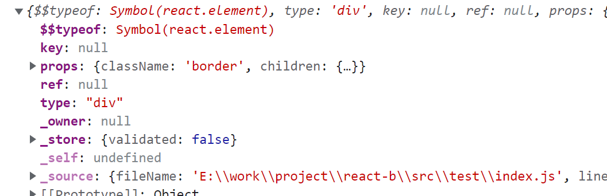
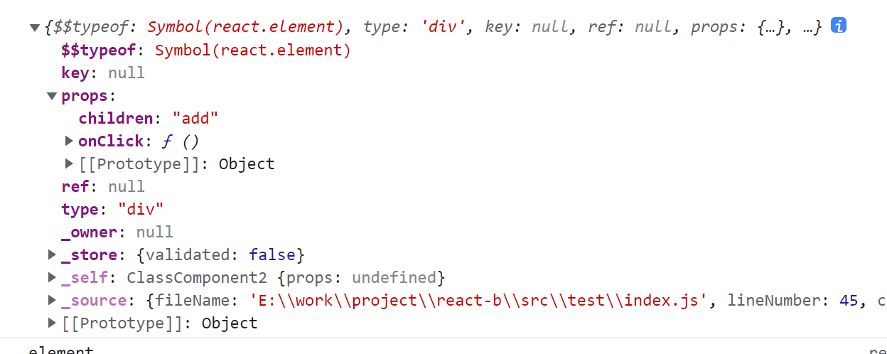

## react基础知识

### react的jsx语法

在react中书写jsx，其实在运行时回被babel进行一次编译转换，编译成React.createElemnt函数嵌套的形式，类似于vue中的render函数，然会结果其实就是一系列的h函数执行结果，也就是vnode。

```jsx
const jsx = (
  <div className="border">
    <h1>JSX</h1>
  </div>
);

// jsx = React.createElement('div', {
//  className: "border",
}// , React.createElement("h1", {}, "JSX"))
```



所以怎么去生成这个jsx编译后的vnode本身不需要我们关心，react利用babel去做了这个操作，后面涉及到vnode怎么转换成真是dom才是需要去考虑的。

### vnode转换为真实dom

这里的vnode其实不等于jsx直接生成的vnode，而是经过react加工后的vnode，也就是fiber节点，后续还是统一叫作vnode。

转换成真实dom其实也很简单，vnode上有个type属性，可以根据type的值来进行判断，主要有：html标签，文本，函数式组件，类组件，fragment。

所以在创建真实dom的时候就要区分上面的几种情况，做不同的操作，比如：

```javascript
if (isStr(type)) {
    // 如果是普通节点
    updateHostComponent(wip);
  } else if (isFn(type)) {
    type.prototype.isClassComponent
      ? updateClassComponent(wip) // 根据isClassComponent判断是否是类组件或者函数组件
      : updateFunctionComponent(wip); //
  }else {
      // 如果是fragment
    updateFragmentComponent(wip);
  }
  
  export function updateHostComponent(wip) {
  if (!wip.stateNode) {
    wip.stateNode = document.createElement(wip.type);
    updateNode(wip.stateNode, wip.props);
  }
  reconcileChildren(wip, wip.props.children);
}

export function updateFunctionComponent(wip) {
  const children = wip.type(wip.props);

  reconcileChildren(wip, children);
}

export function updateClassComponent(wip) {
  const instance = new wip.type(wip.props);
  const children = instance.render();

  reconcileChildren(wip, children);
}

export function updateFragmentComponent(wip) {
  reconcileChildren(wip, wip.props.children)

```

- 如果当前vnode是普通html节点时，只需要创建type类型的html标签，然后将props属性都添加到创建的dom上去即可，对于props后续要注意的是，如果是style对象，则要单独拿出来，遍历style里的属性然后添加到dom.style上去，如果是children则要跳过，因为children要用在后续递归创建真实dom上，如果是以on开头的，则是事件，也要单独做处理，如果是其他的普通属性那就直接添加到dom上即可。
- 如果是类组件，注意，在react中编写类组件的时候是要继承React.Component父类的，所以这个继承的父类其实就给我们提供了许多属性和方法，比如：this.props, this.state, this.foreUpdate等等。因为类和函数用typeof判断结果都是function，所以在类上，会添加一个属性，比如isClassComponent来标识是否是类组件。而对类组件创建vnode也很简单，直接new一下，然后把props当作参数传进去，最后执行类组件实例上的render方法就会得到vnode了，接着就是用vnode去创建真实dom了。递归过程。
- 如果是函数组件，直接执行type这个方法即可，参数就是props，得到的结果就是之后的vnode，然后利用vnode去创建真实dom，递归过程。
- 如果是fragment，它的props.children就是它的子节点的vnode，直接用它的props.children（vnode)，去创建真实dom即可。

注意其实在上面的过程里，会往vnode节点上添加一些属性用于后续操作使用。

### 关于react中setState更新视图

在react类组件里，通过调用setState来更新state数据，视图更新。这里会有几个问题：

1. setState同步异步？
2. 在一个函数中多次调用setState，针对同一个值改变，视图更新几次？

#### 问题一

```jsx
this.setState({
	num: this.stat.num + 1
})

// 本质就是做一次合并操作
// this.state = { ...this.state, ...partialState}
```

setState是一种回调式的异步，不同于异步任务。

setState的作用其实就是去更新this.state中的某个属性，但是更行这一步的操作的执行时机是看react中内部的一个变量，这里暂时把它叫做isBatchUpdate。

在react的事件中isBatchUpdate会被设置成true，于是setState接收到的对象就会被推入一个队列中，而不会立即合并到this.state中。最后通过调用api来一次性更新state，这就造成了setState仿佛是异步的效果。

与之相对的，如果是在setTimeout这种浏览器api中去调用setState，isBatchUpdate就是false，则会立即更新state，就出现了同步的效果。

#### 问题二

视图更新一次，即使是通过回调的形式去更新state，视图也只更新一次，换种说法就是，react只会用最新的state去更新视图。

比如：

```jsx
// this.state.num = 0

this.setState({
	num: this.stat.num + 1
})
this.setState({
	num: this.stat.num + 1
})
this.setState({
	num: this.stat.num + 1
})

// 最终结果this.state.num === 1 -----true
// 视图也只会渲染一次
```

可以看到在react函数中，调用了三次setState，由于异步批量更新state，所以三次设置state.num其实都是设置为了1。

而队列里其实放了三个partialState的值，如下

`const queue = [ {num: this.state.num + 1},  {num: this.state.num + 1}, {num: this.state.num + 1} ]`

那么在合并state时的过程如下

```jsx
// this.state = { num: 0 }
const newState = {
	...this.state,
	...{num: this.state.num + 1},
	...{num: this.state.num + 1},
	...{num: this.state.num + 1}
}

this.state = newState

// 接着再用最新的state去调用class.render或者执行函数组件，得到最新的vnode
// 再用vnode去更新真实dom
```

所以无论setState调用了多少次，newVnode只会生成一次，视图也只会更新一次。

### react合成事件

在jsx语法中，如果要绑定事件，必须得用on开头的形式，比如

```jsx
class ClassComponent extends Component {
  handleClick() {
    console.log('click me')
  }
  render() {
    return (
      <div onClick={this.handleClick.bind(this)}>add</div>
    );
  }
}
```

其中，关于this绑定原因是因为后续相当于一个函数赋值操作，里面的this会丢失，所以要bind下this，也可以在constructor里绑定this，或者用箭头函数的形式去声明函数。

得到的vnode是这个样子



可以看到在props里就会有一个onClick方法。

下面简单点处理其实就可以把onClick转换成小写：onclick，然后创建出真实dom后通过设置dom.onclick = fn即可，这里就是dom0级事件的绑定。

#### 事件代理

不过react利用了事件冒泡来进行的事件绑定，具体如下

```javascript
// 根据vnode创建真实dom
// 在真实dom上创建事件池，将事件设置到事件池上
dom['store'] = {}
dom.store.onclick = fn

// 在document上绑定onclick事件，这个onclick事件如下
document['onclick'] = function (event) {
	const { target, type } = evnet
	const eventType = `on${type.toLowerCase()}`
	const fn = target.store[eventType]
	
	// 将批量跟新标识设置为true
	
	fn(event) // 执行绑定的点击事件
	
	// 调用批量更新函数，结束后将批量更新标识设置为false
}
```

这里直接拿到target，然后就可以在target的事件池里找到对应的事件，把event当作参数传入，然后就可以执行对应函数了。

#### 合成事件

对于react的，点击事件中拿到的event参数，可以看到不是原生的NativeEvent，而是react自己创造的一个合成事件对象，其实原生时间上的大多数属性在react合成事件上都有，之所以要多加一层的原因主要是可以兼容多平台，比如阻止事件冒泡，不同浏览器是不同的，但是在合成事件对象上可以添加一个preventDefault方法，然后这个方法里面去做兼容。在react合成事件里也有一个nativeEvent属性来指向真正的原生事件，可以供后续使用。

### react中ref

#### React.createRef

在react中如果是类组件中使用ref需要我们调用React.createRef方法进行创建，而hooks则使用useRef函数进行创建，原理其实都一样。下面通过React.createRef来创建ref

```jsx
class ClassComponent2 extends Component {
  constructor(props) {
    super(props)
    this.inputRef = React.createRef()
  }
  handleClick = () => {
    this.inputRef.current.focus()
  }
  render() {
    return (
      <div>
        <input ref={this.inputRef} />
        <button onClick={this.handleClick}>click</button>
      </div>
    );
  }
}
```

在react中使用ref，只需要在标签上添加ref属性，值就是我们通过React.createRef创建的对象，然后通过this.inputRef.current则可以操作dom。所以，React.createRef的函数就很好实现了

```javascript
function createRef() {
      var refObject = {
        current: null
      };
      {
        Object.seal(refObject);
      }
      return refObject;
 }
```

其实就是返回了一个对象，里面有一个current属性，然后利用Object.seal让这个对象变得无法被外界操作（添加删除属性），这样后续dom或者组件实例只能通过current属性来获取了。

至于为什么要用一个对象来保存ref，最后只有current发挥作用指向真实dom呢？

其实很简单，在input标签上我们通过设置`ref={this.inputRef}`,那么后续在创建真实dom时候就一定有个操作就是把创建好的真实dom赋值给ref指向的this.inputRef，但是如果this.inputRef是一个基本类型，input标签上保存的ref值就不是一个对象的地址而是this.inputRef的值，这样就做不到保存dom了。所以createRef返回的是一个对象，input标签上的ref保存的就是this.inputRef的地址，在保存dom时我只需要这样写`ref.current = dom`即可。根据引用地址，在函数调用时我们就可以通过this.inputRef.current拿到刚刚设置上去的dom了。

#### 原生标签上的ref

继续来看原生html标签上的ref是怎么设置上去的

```jsx
class ClassComponent2 extends Component {
  constructor(props) {
    super(props)
    this.inputRef = React.createRef()
  }
  handleClick = () => {
    this.inputRef.current.focus()
  }
  render() {
    return (
      <div>
        <input ref={this.inputRef} />
        <button onClick={this.handleClick}>click</button>
      </div>
    );
  }
}
```

原理就是对于当前input的jsx语法糖生成的vnode来说，比如下面过程的伪代码

```javascript
inputVode = {
	type: "input",
	props: {
		ref: this.inputRef
	}
}

inputDom = createDom(inputVnode)

inputVnode.props.ref.current = inputDom
```

按照上面步骤就可以把dom设置上去了。最后通过this.inputRef.current既可以拿到标签的真实dom了

#### 类组件上的ref

下面这个例子，我将ref设置到class组件上面

```jsx
class Demo extends Component {
  constructor(props) {
    super(props)
    this.inputRef = React.createRef()
  }

  getFocus = () => {
    this.inputRef.current.focus()
  }

  render() {
    return <input ref={this.inputRef} />
  }
}

class Outer extends Component {
  constructor(props) {
    super(props)
    this.demoRef = React.createRef()
  }
  handleClick = () => {
    this.demoRef.current.getFocus()
  }

  render() {
    return (<div>
      <Demo ref={this.demoRef} />
      <button onClick={this.handleClick}>click</button>
    </div>)
  }
}
```

可以看到，如果是类组件上的ref，则该ref的current指向的是这个类组件的实例，很好理解，类组件顶层不是一个html标签，所以根本不可能有真实dom，所以react中就把它的ref指向了该组件的类实例上。

方法也很简单，第一次渲染这个类组件的时候一定会new一个它的实例，那么就在这时把该类实例设置到props.ref.current上即可。

#### 函数式组件上的ref

函数式组件的ref改变很大的，如果直接给函数式组件设置ref，控制台会报错，需要使用react提供的方式去声明函数式组件才能往上面设置上ref，参考文档https://react.docschina.org/docs/forwarding-refs.html

```jsx
const FancyButton = React.forwardRef((props, ref) => (
  <button ref={ref} className="FancyButton">
    {props.children}
  </button>
));

// 你可以直接获取 DOM button 的 ref：
const ref = React.createRef();
<FancyButton ref={ref}>Click me!</FancyButton>;
```

这样就可以获取到函数组件里button的真实dom了，下面来简单实现下React.forwardRef方法

```jsx
React.forwardRef = function(fn) {

    // 变成vnode后的大致形式
  return {
    type: {
      $$typeof: Symbol('react.forward_ref'),
      render: fn
    }
  }
}
```

这样在变成vnode的时候就可以通过type上的$$typeof去判断这是一个forwardRef包裹的组件，通过type.render执行即可得到真正函数式组件的vnode，同时：

```jsx
const { ref } = props
const vnode = type.render(props, ref)
```

这样函数式子组件就可以通过第二个参数ref来拿到上层传进来的ref对象，然后子组件中再把这个ref设置到对应的标签上去完事。

#### 类组件，函数组件无真实dom问题

在源码中有需要获取类组件后者函数组件上的dom来进行更新的操作，但是它们没有，所以就是一个简单的递归操作，找它的子vnode，上面去拿子vnode的真实dom，如果还没有，就继续递归下去。

## 使用react hook中遇到的最难的问题

https://react.docschina.org/docs/hooks-faq.html#is-it-safe-to-omit-functions-from-the-list-of-dependencies

## setState什么时候会进行同步操作

https://blog.csdn.net/qq_43182723/article/details/106802413
https://stackoverflow.com/questions/48563650/does-react-keep-the-order-for-state-updates/48610973#48610973
https://github.com/facebook/react/issues/11527